考点：

1. 位置规律
2. 样式规律
3. 属性规律
4. 特殊规律
5. 数量规律
6. 空间规律

- 根据图形特征快速定位考点
- 什么样的图形特征对应什么考点
- 一个考点具体怎么考
# 一、位置规律

- 图形特征： 元素组成相同 
- 考点
	1. 平移
	2. 旋转、翻转

## 1.1位置规律-平移

> 沿着什么方向，走了多少步

方向：
- 直线（上下、左右、斜对角线），绕圈（顺时针、逆时针）

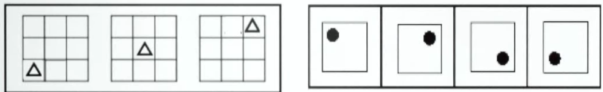

常见步数：
- 平移
- 恒定，递增（等差）

### 题型

#### 宫格类题目

1. 平移题目以宫格类题目居多（九宫格，十六宫格）
2. 解题技巧： 看中间，判方向（里圈外圈分开看）
	1. 绕圈走：中间颜色数量相同，优先考虑内外圈分开看
		![[图形推理-平移-宫格类题目.png]]
	2. 走直线：
		- 横行黑块数量相同-> 左右走
		- 竖行黑块数量相同-> 上下走
			![[图形推理-平移-宫格类题目2.png]]
			

> 技巧：就近假设，有两个相同元素时

#### 走重合判定

**同时满足以下两个条件，即使黑块个数不完全相同，也可以考虑位置平移。**
1. 题干和选项绝大多数图形快数相同；
2. 走重合时，块数最少的图形一般不在第一幅图。

![[图形推理-平移-走重合题.png]]

### 小结

**重难点：**
1. 元素组成基本相同，优先考虑位置，空白也可以作为平移小元素；
2. 多宫格，优先内外分开看，有唯一答案可以直接选；
3. 出现相同元素，盯住一个，就近假设。

![[图形推理.png]]

## 1.2位置规律-旋转、翻转

### 旋转

1. 方向：顺、逆时针
2. 常见角度：45、60、90、120、180
3. 常见形式：钟表类、整体类

![[图形推理-旋转-题型.png]]

**重难点：**

- 钟表类爱考旋转；
- 判断平移/旋转方向：就近走

### 翻转

1. 左右翻转：竖轴对称
2. 上下翻转：横轴对称

**快速判断翻转技巧：**

![[图形推理-翻转-快速判断翻转.png]]

**翻转旋转，哪里简单看哪里：**

![[图形推理-翻转-快速技巧.png]]

## 思维导图

![[图形推理-位置规律思维导图.png]]

# 二、样式规律

- 图形特征：元素组成相似（线条、颜色）
- 考点：
	1. 遍历
	2. 加减同异
	3. 黑白运算

![[图形推理-样式规律.png]]

## 2.1样式规律-遍历（缺啥补啥）

### 图形特征

相同元素（或颜色）重复出现，缺啥补啥

![[图形推理-样式规律-遍历特征.png]]

![[图形推理-样式规律-遍历特征2.png]]

### 常见考法

1. 外框遍历
2. 内部图形遍历

## 2.2样式规律-加减同异（线条运算）

### 图形特征：

相同线条重复出现

### 常见考法：

1. 相加、相减
2. 求异（去同存异，最常考）： 相同的东西去掉留下不同的
3. 求同（去异存同）

![[图形推理-样式规律-加减同异特征.png]]

### 加减同异难点：结合位置规律

**思路一：**

图1与图2有明显相同线条--先加减同异

![[图形推理-样式规律-加减同异难点.png]]
**思路二：**

图1与图2没有明显相同线条--先位置，谁搞特殊先转谁

![[图形推理-样式规律-加减同异难点2.png]]

### 总结

![[图形推理-样式规律-加减同异总结.png]]

**重难点：**
1. 选项有两个长得一样，位置不同，可结合考
2. 图一图二有明显一样线条，先加减同异；
3. 图一图二没有明显一样的线条，先位置

## 2.2样式规律-黑白运算（颜色运算）

### 图形特征：

图形轮廓和分割区域相同，且黑块数量不成规律

### 解题技巧

相同位置运算

![[图形推理-样式规律-黑白运算.png]]

**注意：**
1. 运算规则具体题目找
2. 黑+白 不一定等于 白+黑
3. 黑块数量相同，优先平移；黑块数量不同，优先黑白运算

**小技巧：**
1. 结合选项，要啥找啥，边找边验证
2. 优先找同色大面积相连位置
![[图形推理-样式规律-黑白运算-同色大面积技巧.png|450]]

## 思维导图

![[图形推理-样式规律思维导图.png]]

# 三、属性规律

**图形特征** - 元素组成不同

![[图形推理-属性规律-图形特征.png]]

**考点** 
1. 对称性
2. 曲直性
3. 开闭性

## 3.1属性规律-对称性

### 图形特征

**轴对称：** 等腰图形
![[图形推理-属性规律-对称性-特征图等腰.png]]

**中心对称：** 平行四边形、S、N、Z变形图；相同图形反着放
![[图形推理-属性规律-对称性-特征图中心对称.png]]

**轴+中心对称：** 图形存在相互垂直的对称轴
![[图形推理-属性规律-对称性-特征图轴中心对称.png]]

### 对称性考法

#### 考法1：区分轴对称中心对称
![[图形推理-属性规律-对称性-考点-对称性.png]]

#### 考法2：对称轴的方向和数量
![[图形推理-属性规律-对称性-考点-轴方向数量.png]]

养成好习惯：发现轴对称图形，立刻画轴

>解题步骤：等腰元素出现->考虑对称性->画出对称轴->方向、数量

**等边三角形（三足鼎立）** -- 常考对称轴数量
![[图形推理-属性规律-对称性-考点-等边三角形.png]]

#### 考法3：对称轴与图形线、点、面的关系

![[图形推理-属性规律-对称性-考点-轴与线点面关系.png]]

#### 考法4：对称轴之间夹角关系

>几个等腰图形拼合在一起，分开画轴，看轴与轴之间的关系

![[图形推理-属性规律-对称性-考点-轴之间夹角关系.png]]

### 对称性总结

![[图形推理-属性规律-对称性-总结.png]]

**如何想到？记住特征！**
1. 轴对称：“等腰”元素出现
2. 中心对称：平行四边形/N/Z/S变形图出现、成对的相同图形反着放
3. 轴对称+中心对称：图形存在相互垂直的对称轴

## 3.2属性规律-曲直性

**考法：**
1. 全曲线
2. 全直线
3. 曲+直（考的少）

![[图形推理-属性规律-曲直性-例题.png|500]]
**从第二行第一列分析出不可能是考对称性**

## 3.3属性规律-开闭性

**考法：**
1. 全封闭-仍里出不来了
![[图形推理-属性规律-开闭性-全闭.png]]
2. 全开放
![[图形推理-属性规律-开闭性-全开.png]]

3. 半封闭
![[图形推理-属性规律-开闭性-半开闭.png]]
### 图形特征：
- 对称曲直无规律时考虑
- 完整图形留了小开口
- 生活化或粗线条图形，考虑开闭性

## 思维导图
![[图形推理-属性规律-思维导图.png]]

# 四、特殊规律

## 4.1特殊规律-图形间关系

### 图形特征
题干出现两个或多个封闭图形连在一起

### 考点
1. 相离：图形分开，没有公共部分
![[图形推理-特殊规律-图形间关系相离考点.png]]
2. 相交：
	1. 相较于点
	2. 相较于线：
		数量、样式（长/短、整体/部分）
		![[图形推理-特殊规律-图形间关系相交考点.png]]
3. 相交于面：相交面形状
	![[图形推理-特殊规律-图形间关系相交于面考点.png]]

**出现两个或多个封闭图形连在一起--图形间关系**
**关注相交部分（将相交部分描画出来）**

### 总结：

均由两个小图形构成
- 若均为对称图--拆分看对称
- 若存在不对称--看图形间关系

## 4.2特殊规律-功能元素（标记作用）

### 图形特征
每幅图都出现黑点、白点或箭头等小元素

### 考点
1. 点：交点（直直/曲曲/直曲）
2. 线：（1）直线/曲线 （2）最长线/最短线
3. 角：（1）直角/锐角/钝角 （2）最大角/最小角
4. 面：（1）重合面/单独面 （2）最大面/最小面

## 思维导图
![[图形推理-特殊规律-思维导图.png]]

# 五、数量规律

## 图形特征：
1. 元素组成不同，且属性没规律
2. 数量“特征图”明显

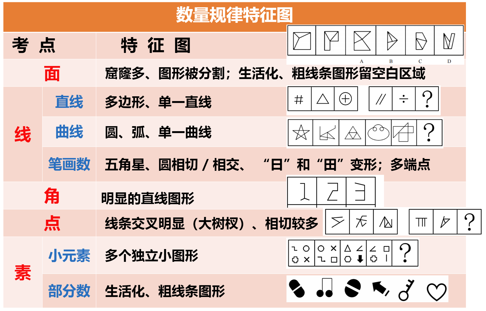
## 考点：面、线、点、角、素

### 考法1：面数量

1. 什么是面？白色的封闭区域
![[图形推理-数量规律-考点-面数量.png]]
2. 元素组成不同，什么时候数面？
	1. 图形被分割、封闭面明显
	2. 生活化、粗线条图形
	
	
	
![[图形推理-数量规律-考点-面数量2.png|275]]

#### 面的细化考法

##### 1.所有面的形状
数面后，答案面相同，具体看面形状
![[图形推理-数量规律-考点-面数量-细化1.png]]

##### 2.部分面：相同形状面的个数
![[图形推理-数量规律-考点-面数量-细化2.png|400]]
##### 3.单个面：最大/小面的形状、属性
![[图形推理-数量规律-考点-面数量-细化3.png]]

#### 面数量总结

1. 什么是面：
	封闭空间-白色的封闭区域
2. 面数量特征图：
	图形被分割、封闭面明显（白色窟窿多）
3. 面细化考法：
	1. 所有面的形状
	2. 相同面的数量
	3. 单个面的形状

### 考法2：线数量

1. 什么是线？直线、曲线
2. 元素组成不同，什么时候数直线/曲线？
	“直线”特征图：多边形、单一直线
	![[图形推理-数量规律-考点-线数量-直线特征图.png]]
	“曲线”特征图：曲线图形（全曲线图、圆、弧）
	![[图形推理-数量规律-考点-线数量-曲线特征图.png]]

#### 线的特殊考点：笔画问题

##### **一笔画：** 图形由一笔画成，线条不能重复来回画

1. 线条之间连通
2. 奇点数=0或2
 
奇点：发射出奇数条线的点， **端点也是奇点**
![[图形推理-数量规律-考点-线数量-一笔画-奇点.png]]

![[图形推理-数量规律-考点-线数量-一笔画-奇点2.png]]

##### 多笔画图形

- 笔画数=奇点数/2 （奇点总数一定是偶数个）
- 不连通的图形，要分别用上面的公式算出，然后相加
![[图形推理-数量规律-考点-线数量-多笔画-笔画数.png]]

**笔画数常见特征图**

1.五角星；2.“日” “田”及其变形；3.圆相切/相交；4.出现明显端点

![[图形推理-数量规律-考点-线数量-笔画数特征图.png]]

**笔画数特征图新趋势：** 出头端点（所有的端点都是奇点）

![[图形推理-数量规律-考点-线数量-笔画数特征新趋势.png]]

#### 线数量总结

1. 线数量考点：
	- 直线、曲线、笔画数量
2. 什么时候数线：
	1. 直线数特征图：多边形、单一直线
	2. 曲线数特征图：曲线图形（单一曲线、圆、弧）
3. 笔画问题：
	1. 笔画数特征图：断电多、圆相交、日、田、五角星
	2. 一笔画条件：连通圆+奇点数为0或2
	3. 多笔画公式：奇点数/2

### 考法3：点数量

1. 什么是点？这里指线与线的交点，端点不是交点
2. 元素组成不同，什么时候数点？
	1. 线条交叉明显（大树杈）
	2. 图形相切较多
	3. 数笔画没规律

#### 点的细化考法

>出现数点特征图，但整体数点无规律，考虑点的细化，数切点、曲直交点、内外交点
##### 1.切点：出现较多相切的情况
有较多切点，并且数点无规律的时候就考虑切点规律
![[图形推理-数量规律-考点-点数量-细化考法切点数.png]]

##### 2.曲直交点：曲直交叉明显
 同上，数线、笔画、数点无规律时，并且有较多的曲直交点
##### 3.内外交点：存在明显框架图形 
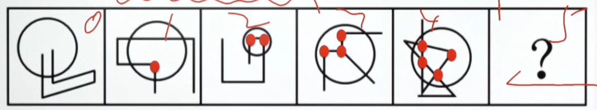

## 考法4：角数量

1. 什么是角？
	直线与直线的交点，并且只考小于 180°的角

1. 细化考法：直角数
2. 特征图：明显的直角图
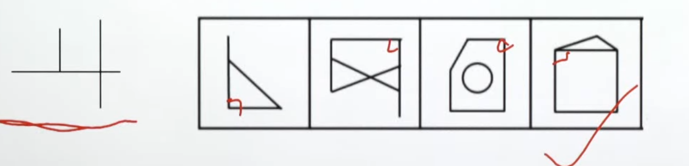

## 考法5：素数量

1. 什么是素？
	（1）多个独立小图形 
	（2）部分数，连在一起就是一部分

2. 出现小元素，做题思路？
	1. 优先考虑元素种类和个数
	2. 选不出唯一答案，考虑找相同
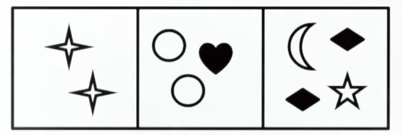

3. 什么时候考虑部分数？
	生活化、粗线条图形
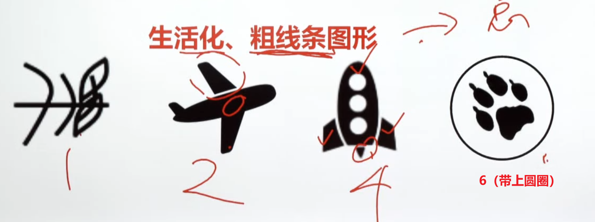

## 生活化、粗线条图形常见考法：

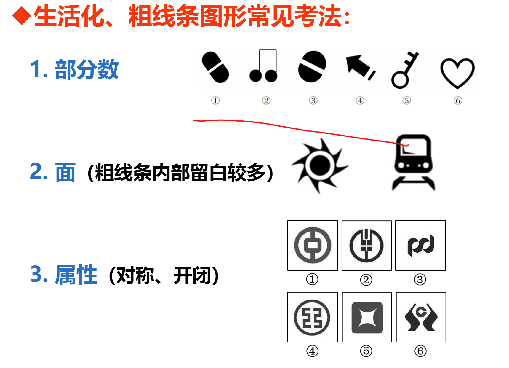
**面数白的，素数黑的块，太阳就是一个面、两个素**

## 数量规律思维导图

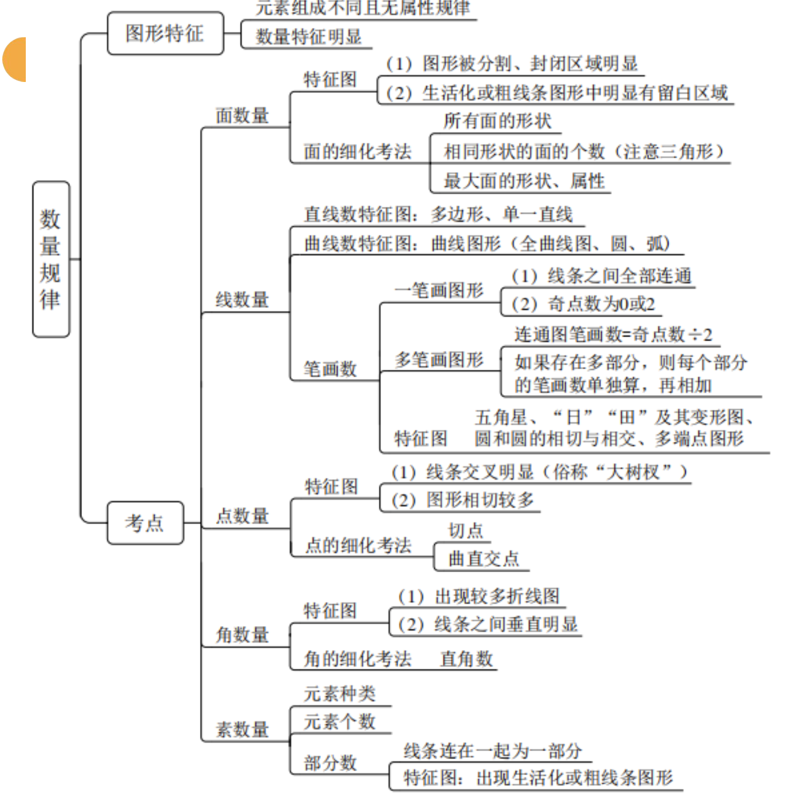

# 六、空间重构

技巧：所有的方法都是排除错误选项的

## 方法一：相对面

>相对面不能同时出现--优先排除相对面同时出现的选项

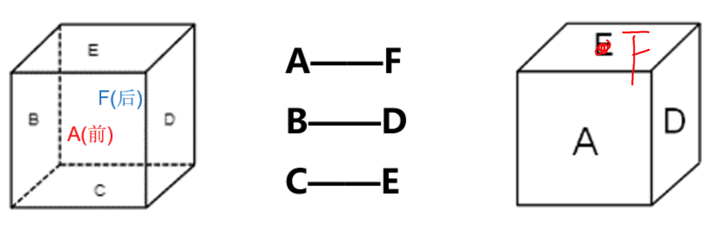

### 展开图中如何判断相对面

1. 同行或同列相隔一个面
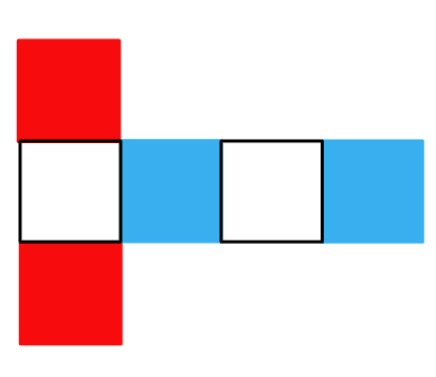
2. Z字形两端（紧邻Z字中线的面）
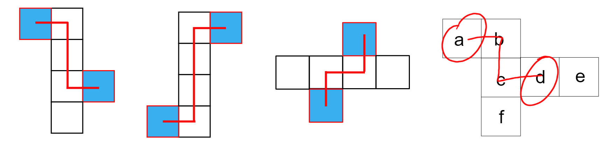

## 方法二：相邻面-公共边

>公共边的应用：折叠前后相邻关系不变

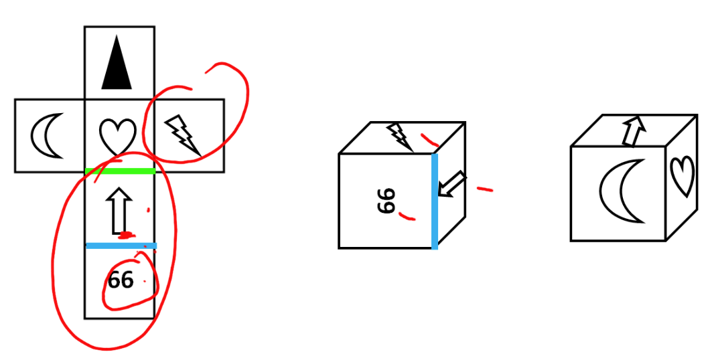
### 如何确定公共边：

1. 平面图中构成直角的两条边是同一条边
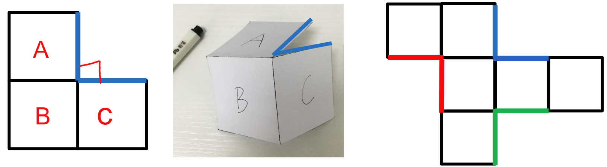
2. 一列/行连着四个面，两头的两条边是同一条边
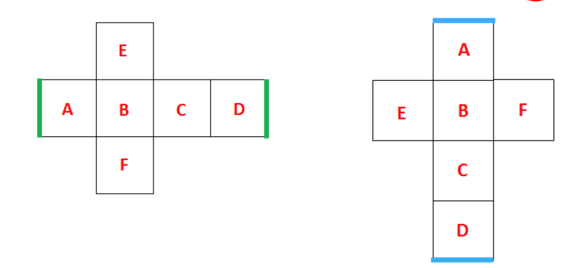

## 方法三：相邻面-公共点

>应用：公共点发射出的线条的数量或图案折叠前后不变

 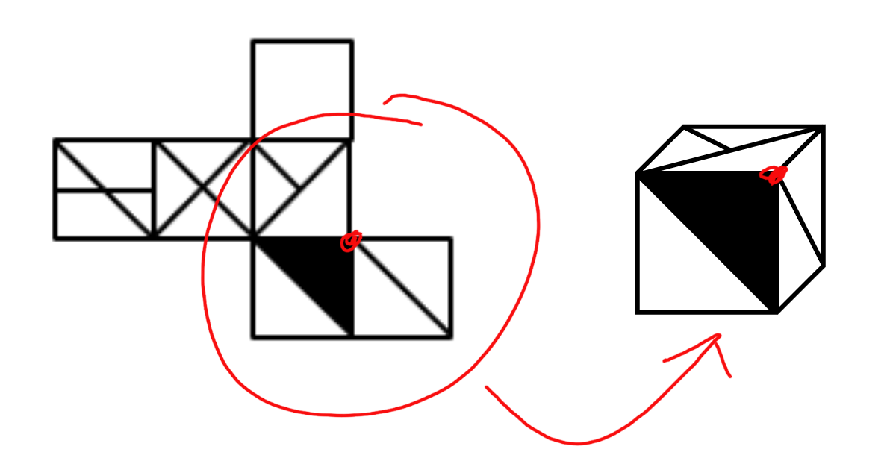
**如何确定公共点：** 相邻三个面的公共点是唯一的

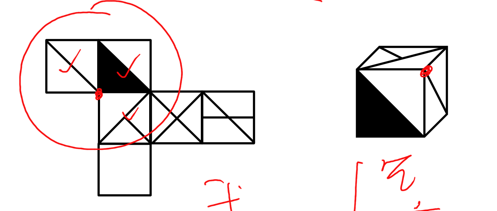
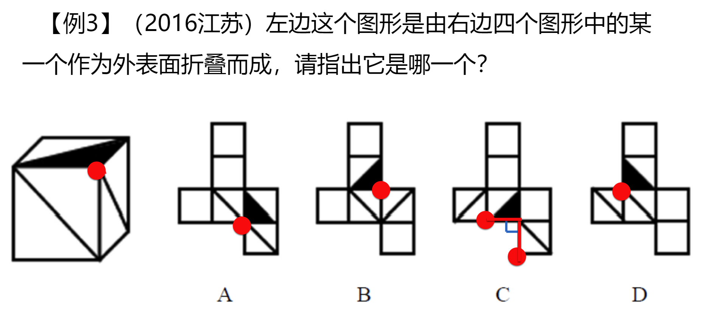

## 方法四：相邻面-化边法

1. 结合选项，找一个特殊面的唯一点或唯一边
2. 顺/逆时针方向描边标号（描同一个面）
3. 题干与选项对应面不一致--排除

### 唯一点：

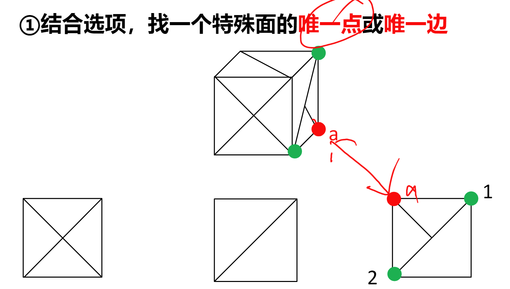

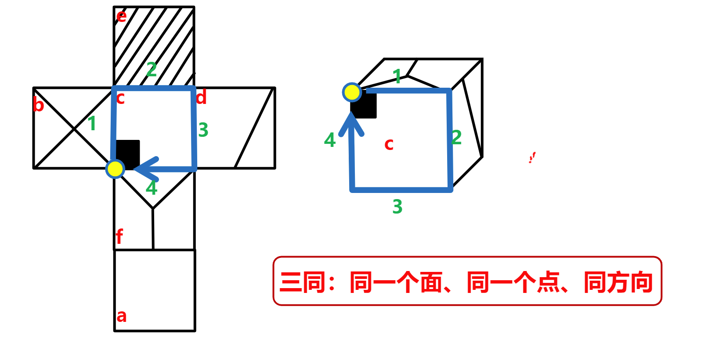

**使用时机：** 
- 当多个选项都存在相同唯一点时用
- 当前面所学方法没法判断时用

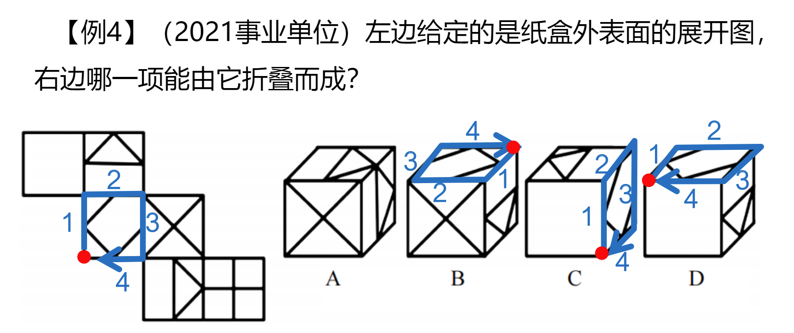

### 唯一边

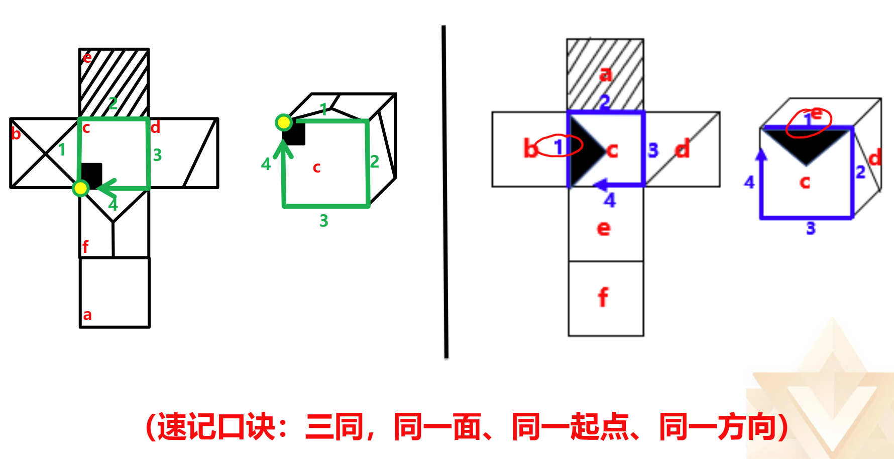

## 小结：
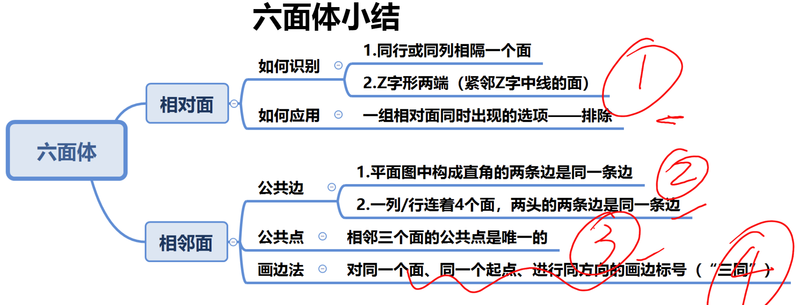

