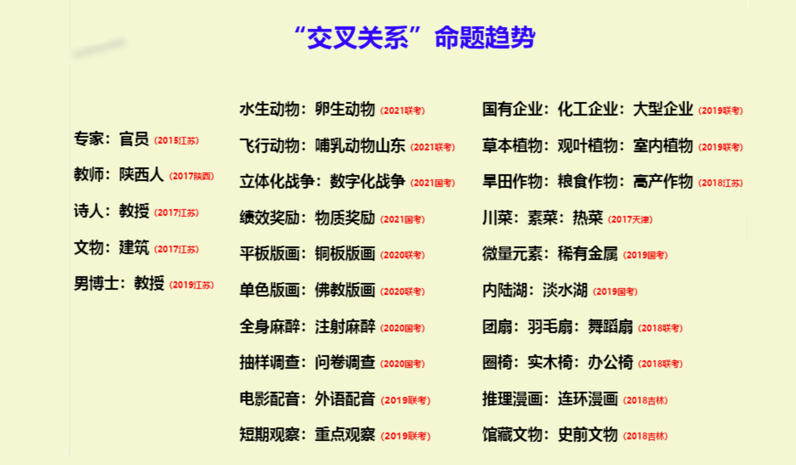
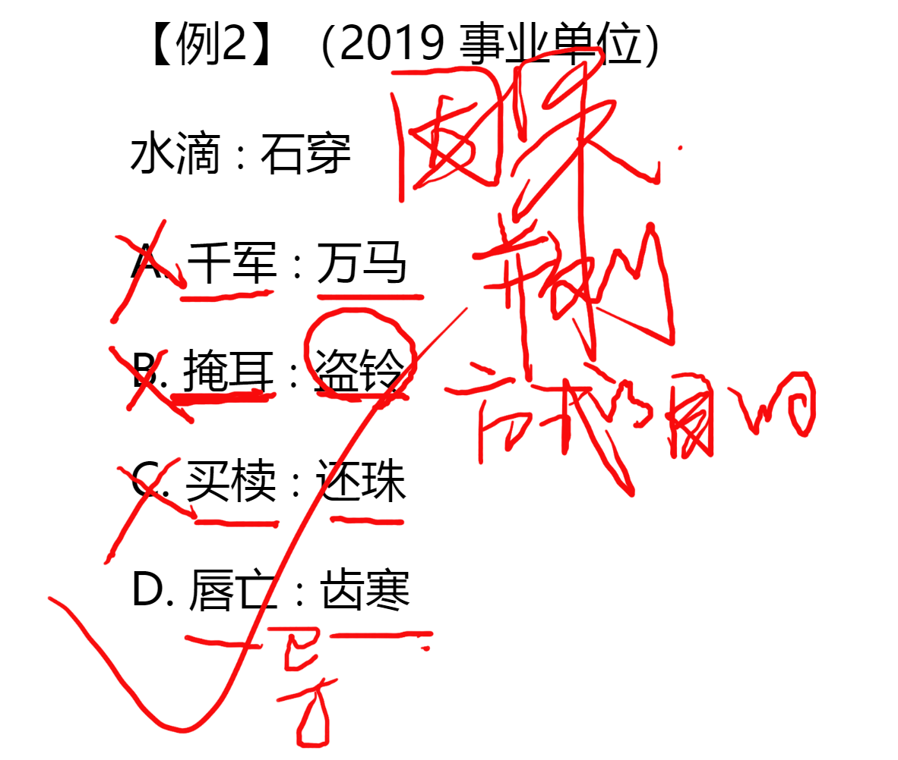

>给出一组相关的词，要求通过观察分析，在备选答案中找出一组与之在逻辑关系上**最为贴近或相似**的词。

常见形式：
1. 两词型--A: B
2. 三词型--A: B: C
3. 填空型--A 对于（）相当于（）相对于 B

# 考点题型：
- 语义关系
- 逻辑关系
- 语法关系

# 一、语义关系

### 考点1：近义关系、反义关系

近义关系
- 开心：高兴
- 言不由衷：口是心非

反义关系
- 勤奋：懒惰
- 一丝不苟：粗枝大叶

注意成语积累
 

#### 二级辨析
如果一级关系（近反义关系）选不出唯一答案--进行二级辨析，选项与题干感情相同

常见二级辨析：感情色彩（褒义、贬义、中性）

### 考点2：比喻象征义

>比喻义、象征义：把一种事物比喻成另外的事物，或者词语本身的含义同时是另外一种事物的象征。

# 二、逻辑关系

### 考点：
1. 全同关系
2. 并列关系
3. 包容关系
4. 交叉关系
5. 对应关系

### 考点1：全同关系

A=B
- 老鼠：耗子
- 土豆：马铃薯
- 河北：冀
- 引擎：发动机

### 考点2：并列关系

>按照同一种分类标准，同一维度划分，A、B不同，但地位相当，
>分为矛盾、反对关系，区分：是否存在第三种

**例如：**

按性别分
	男：女

按季节分
	冬装：夏装

#### 1.矛盾关系（非此即彼）

男：女（注意中国公务员）
生：死
对称：不对称

#### 2.反对关系（还有其他的）

白色：红色
苹果：香蕉

#### 例题：

例二，二级辨析：时间顺序

### 考点3：包容关系

#### 1.种属关系（A是B的一种）

白菜：蔬菜
苹果：水果

#### 2.组成关系（A是B的一个组成部分）

扇面：扇子
江苏：中国

#### 区分：

**能用“A是B”造句的就是种属关系**

例如：
珠海：特区
珠海是特区 通顺，所以珠海：特区是种属关系

### 考点4：交叉关系

- 题干特征：从不同角度描述同一类事物
- 判定技巧--造句子，通顺就是交叉关系
	- 有的A是B，有的A不是B
	- 有的B是A，有的B不是A

### 考点5：对应关系

#### 1.材料
面粉：面包

#### 2.功能
灯：照明：装饰（一般为名词+动词/动宾组合）

二级辨析：主要/次要功能

#### 3.属性
盐：咸（一般为名词+形容词组合）

**爱考二级辨析--必然/或然属性：**

A. 盐：咸（必然）
B. 花：红（或然）
B. 花：香（或然）

#### 4.时间顺序
招标：投标（一般为动词+动词组合）
 
**二级辨析：主体能否一致** 招标投标主体不一致 

#### 5.因果
因果也有时间顺序，因在前果在后
暴雨：山洪
酒驾：车祸（二级辨析：原因自然/人为）

### 逻辑关系总结

# 三、语法关系

## 技巧：造句子

1. 主谓关系  歌手：演唱
2. 动宾关系  提出：问题
3. 主宾关系  农民：水稻
4. 偏正关系  蔚蓝：天空（中间加的通顺就是偏正）

**造句原则：**
- 造简单句：能不加字就不加字，能少加字就少加字
- 加字尽量加一样的

# 四、拆词

**什么时候考虑拆分？**

1. 相同单字反复出现
	寒：寒冷：寒舍

2. 成语被拆分
	大同：小异 （反义）
	唇亡：齿寒（因果）

3. 两个词语之间没有明显逻辑关系
	成败：呼吸（词之间无关系，词自己反义）

## 因果
 
 

## 方式目的

**二级辨析：能否达到目的**

## 偏正

# 类比推理总结
