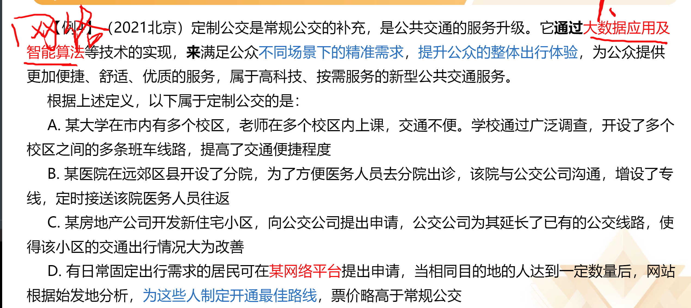

>每道题先给出一个概念定义，然后分别列出四种情况，要求报考者严格依据定义选出一个最符合或最不符合该定义的答案

# 解题思维

#### 1.看提问：
“属于/符合”，“不属于/不符合”定义等

#### 2.看题干：
识别有效信息--找准关键词、关键句

#### 3.看选项：
当纠结时采用对比的思维进行排除，最终选择更符合题干要求的选项，学会接受不完美！！！

### 对比择优，接受不完美

>没提到题干某个关键词的，不一定错；
>与题干某个关键词违背的，一定错。  

**例题：**

# 考点一：读的准

## 方法一：关键词--主体、客体

- 主体---行为、活动的发出者
- 客体---行为、活动作用的对象

### 思路：
1. 不是每题一定都有主客体，但是出现了要重点看！主客体错误的选项一定不符合定义！
2. 范围越小、越明确的主、客体，越容易成为挖坑点

### 例题：

消费者协会不是行政机关

 
 
 
### 真题常考主客体：

## 方法二：句式-引导的内容重点看

### 思路：
- 方式：通过、利用......
- 目的：以、达到、来......
- 原因：因为、由于......
- 结果：导致、从而、使得......
- 大前提：当......时，在......情况下/过程中，在......前/后

### 例题：

# 考点二：读的块

## 1.优先看到概念所在的那句话的句号

## 2.注意阅读补充说明

**常见补充说明关键词**

即、包括、也就是说、以下情形、换言之、通俗地讲、具体表现为... ...

## 3.多定义问啥看啥，纠结两个选项时，再与其他定义比较

**由选项反向看题干**

# 考点三：小技巧

## 拆词
运用：定义本身词汇通俗易懂，优先关注

换城消费  斜杠青年  体验式教学  情感广告  异株克生

### 拆词的应用
1. 定义词汇本身通俗易懂
2. 选项纠结时

# 定义判断总结

