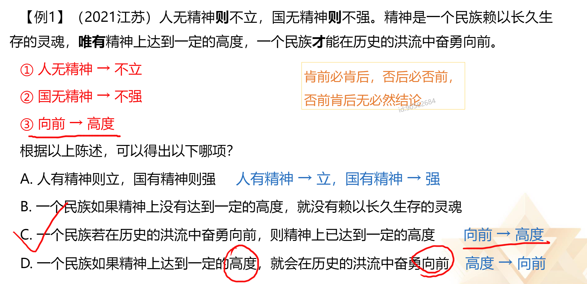
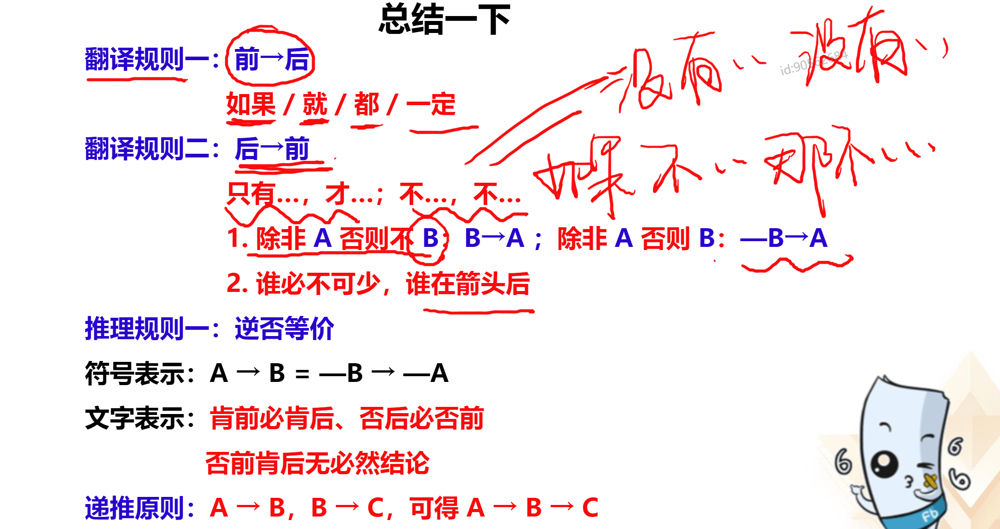

### 题型：

1. 翻译推理
2. 集合推理
3. 组合排列
4. 真假推理
5. 逻辑论证
6. 原因解释
7. 日常结论

# 一、翻译推理

## 题目特征
1. 题干和选项中存在明显的逻辑关联词
2. 提问方式为：可以推出/不能推出

**例如：**
领导干部如果没有底线思维，就不能做到严格自律。只有不忘初心，才能始终保持底线思维。也只有始终坚守理想信念，才能不忘初心。
由此可以推出：

## 解题思维
1. 先翻译（通过翻译规则，翻译成 1->2的形式）
2. 再推理（根据推理规则进行推理）

### 解题步骤梳理：
1. 对题干进行翻译；
2. 对选项进行推理，看选项箭头的词，对题干否前/肯后推不出必然性结论。

## 翻译规则

### 1.前推后

典型关联词：如果...A..., 那么...B...      A->B 在A条件下B一定发生
(关联词圈起来，剩下的内容，前半句->后半句)

例句：
如果你想上岸，那么请先刷题
上岸->刷题   （简写帮你做的快）

#### 等价关联词：（前->后）

- 如果...A..., 那么...B...
- 若......, 则......;
- 只要......, 就......;
- 所有......, 都......;
- 为了......, 一定（必须）......;
- ......是......的充分条件

**牢记：**
如果、就、都、一定

### 2.后推前

典型关联词：只有...A... 才...B...      B->A
(关联词圈起来，剩下的内容，后半句->前半句)

例句：
只有出公告了，才能报名
报名->公告

#### 等价关联词：（后->前）

- 不......不......；
	- 如果不...A...那么不...B...；
	- -A -> -B
	- B -> A
- 除非......，否则不......；
- ......是......的基础/假设/前提/关键；
- ......是......的必要/必不可少条件；

#### 后推前关联词是变形

1. 除非 A 否则 不 B：B->A
	除非 A 否则 B: -B -> A

例句：除非交房租，否则搬出去
	-搬出去 -> 交房租

2. 基础/前提/关键；不可缺少/必不可少；必要条件
	 谁必不可少，谁在箭头后

例句1：
	食物是人类生存必不可少的。
	人类生存，食物是必不可少的。
	生存->食物

例句2：
	建大厦的基础是修好地基。
	大厦->地基

例句3：
	想成功，不懈的努力是前提。
	成功->努力

谁充分，谁在箭头前；谁必要，谁在箭头后

## 推理规则
### 1.逆否等价

#### 符号标识：A -> B = -B -> -A
#### 文字表示：
- 肯前必肯后、否后必否前
- 否前肯后无必然结论（可能、可能不）

**例：** 如果某人是北京人，那么他一定是中国人。

**例二：串串**

## 总结

## 且和或的翻译

A且B：二者同时成立
等价关键词：和、既... 又... 、不仅... 而且... 、 ... 但是 ...
例句：
	我很丑，但是我很抢手
	我丑 且 枪手 （必同时成立）

A或B：二者至少一个成立
等价关键词：...或者...、或者...或者...、...和...至少一个
例句：
	我想带你去东京或者巴黎
	三种可能
	1. 东京、-巴黎
	2. 巴黎、-东京
	3. 东京 且 巴黎

## 或的推理：否一推一

或关系为真时，否定一项可以得到另一项。

**A或B：**    
推理：
- -A -> B
- -B -> A

**例：** 东京 或 巴黎
	1. 东京、-巴黎
	2. 巴黎、-东京
	3. 东京 且 巴黎
如果 -巴黎 为真，则 东京 为真
反之亦然

**例：** 不吃火锅 或 不吃烤肉
	 火锅 -> -烤肉
	 烤肉 -> -火锅

### 拓展

要么A要么B: 二者只有一个成立

例句： 要么生，要么死

等价关键词： ... 和... 只能有一个

## 推理规则之"德.摩根定律"

速记口诀： ”-“ 进去，”且“ ”或“ 互变

## 总结二

## 推理形式

**提问方式：**
以下哪项中的推理形式/结构与题干中的推理形式/结构相同/相似

**重结构 轻内容** （可借助字母）

## 翻译推理思维导图
