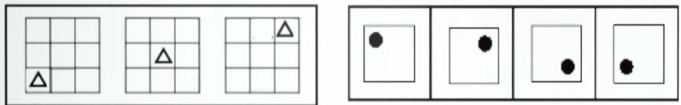

考点：

1. 位置规律
2. 样式规律
3. 属性规律
4. 特殊规律
5. 数量规律
6. 空间规律

- 根据图形特征快速定位考点
- 什么样的图形特征对应什么考点
- 一个考点具体怎么考
# 一、位置规律

- 图形特征： 元素组成相同 
- 考点
	1. 平移
	2. 旋转、翻转

## 1.1位置规律-平移

> 沿着什么方向，走了多少步

方向：
- 直线（上下、左右、斜对角线），绕圈（顺时针、逆时针）

常见步数：
- 平移
- 恒定，递增（等差）

### 题型

#### 宫格类题目

1. 平移题目以宫格类题目居多（九宫格，十六宫格）
2. 解题技巧： 看中间，判方向（里圈外圈分开看）
	1. 绕圈走：中间颜色数量相同，优先考虑内外圈分开看
		![[图形推理-平移-宫格类题目.png]]
	2. 走直线：
		- 横行黑块数量相同-> 左右走
		- 竖行黑块数量相同-> 上下走
			![[图形推理-平移-宫格类题目2.png]]
			

> 技巧：就近假设，有两个相同元素时

#### 走重合判定

**同时满足以下两个条件，即使黑块个数不完全相同，也可以考虑位置平移。**
1. 题干和选项绝大多数图形快数相同；
2. 走重合时，块数最少的图形一般不在第一幅图。

![[图形推理-平移-走重合题.png]]

### 小结

**重难点：**
1. 元素组成基本相同，优先考虑位置，空白也可以作为平移小元素；
2. 多宫格，优先内外分开看，有唯一答案可以直接选；
3. 出现相同元素，盯住一个，就近假设。

![[图形推理.png]]

## 1.2位置规律-旋转、翻转

### 旋转

1. 方向：顺、逆时针
2. 常见角度：45、60、90、120、180
3. 常见形式：钟表类、整体类

![[图形推理-旋转-题型.png]]

**重难点：**

- 钟表类爱考旋转；
- 判断平移/旋转方向：就近走

### 翻转

1. 左右翻转：竖轴对称
2. 上下翻转：横轴对称

**快速判断翻转技巧：**

![[图形推理-翻转-快速判断翻转.png]]

**翻转旋转，哪里简单看哪里：**

![[图形推理-翻转-快速技巧.png]]

## 思维导图

![[图形推理-位置规律思维导图.png]]

# 二、样式规律

- 图形特征：元素组成相似（线条、颜色）
- 考点：
	1. 遍历
	2. 加减同异
	3. 黑白运算

![[图形推理-样式规律.png]]

## 2.1样式规律-遍历（缺啥补啥）

### 图形特征

相同元素（或颜色）重复出现，缺啥补啥

![[图形推理-样式规律-遍历特征.png]]

![[图形推理-样式规律-遍历特征2.png]]

### 常见考法

1. 外框遍历
2. 内部图形遍历

## 2.2样式规律-加减同异（线条运算）

### 图形特征：

相同线条重复出现

### 常见考法：

1. 相加、相减
2. 求异（去同存异，最常考）： 相同的东西去掉留下不同的
3. 求同（去异存同）

![[图形推理-样式规律-加减同异特征.png]]

### 加减同异难点：结合位置规律

**思路一：**

图1与图2有明显相同线条--先加减同异

![[图形推理-样式规律-加减同异难点.png]]
**思路二：**

图1与图2没有明显相同线条--先位置，谁搞特殊先转谁

![[图形推理-样式规律-加减同异难点2.png]]

### 总结

![[图形推理-样式规律-加减同异总结.png]]

**重难点：**
1. 选项有两个长得一样，位置不同，可结合考
2. 图一图二有明显一样线条，先加减同异；
3. 图一图二没有明显一样的线条，先位置

## 2.2样式规律-黑白运算（颜色运算）

### 图形特征：

图形轮廓和分割区域相同，且黑块数量不成规律

### 解题技巧

相同位置运算

![[图形推理-样式规律-黑白运算.png]]

**注意：**
1. 运算规则具体题目找
2. 黑+白 不一定等于 白+黑
3. 黑块数量相同，优先平移；黑块数量不同，优先黑白运算

**小技巧：**
1. 结合选项，要啥找啥，边找边验证
2. 优先找同色大面积相连位置
![[图形推理-样式规律-黑白运算-同色大面积技巧.png|450]]

## 思维导图

![[图形推理-样式规律思维导图.png]]

# 三、属性规律

**图形特征** - 元素组成不同

![[图形推理-属性规律-图形特征.png]]

**考点** 
1. 对称性
2. 曲直性
3. 开闭性

## 3.1属性规律-对称性

### 图形特征

**轴对称：** 等腰图形
![[图形推理-属性规律-对称性-特征图等腰.png]]

**中心对称：** 平行四边形、S、N、Z变形图；相同图形反着放
![[图形推理-属性规律-对称性-特征图中心对称.png]]

**轴+中心对称：** 图形存在相互垂直的对称轴
![[图形推理-属性规律-对称性-特征图轴中心对称.png]]

### 对称性考法

#### 考法1：区分轴对称中心对称
![[图形推理-属性规律-对称性-考点-对称性.png]]

#### 考法2：对称轴的方向和数量
![[图形推理-属性规律-对称性-考点-轴方向数量.png]]

养成好习惯：发现轴对称图形，立刻画轴

>解题步骤：等腰元素出现->考虑对称性->画出对称轴->方向、数量

**等边三角形（三足鼎立）** -- 常考对称轴数量
![[图形推理-属性规律-对称性-考点-等边三角形.png]]

#### 考法3：对称轴与图形线、点、面的关系

![[图形推理-属性规律-对称性-考点-轴与线点面关系.png]]

#### 考法4：对称轴之间夹角关系

>几个等腰图形拼合在一起，分开画轴，看轴与轴之间的关系

![[图形推理-属性规律-对称性-考点-轴之间夹角关系.png]]

### 对称性总结

![[图形推理-属性规律-对称性-总结.png]]

**如何想到？记住特征！**
1. 轴对称：“等腰”元素出现
2. 中心对称：平行四边形/N/Z/S变形图出现、成对的相同图形反着放
3. 轴对称+中心对称：图形存在相互垂直的对称轴

## 3.2属性规律-曲直性

**考法：**
1. 全曲线
2. 全直线
3. 曲+直（考的少）

![[图形推理-属性规律-曲直性-例题.png|500]]
**从第二行第一列分析出不可能是考对称性**

## 3.3属性规律-开闭性

**考法：**
1. 全封闭-仍里出不来了
![[图形推理-属性规律-开闭性-全闭.png]]
2. 全开放
![[图形推理-属性规律-开闭性-全开.png]]

3. 半封闭
![[图形推理-属性规律-开闭性-半开闭.png]]
### 图形特征：
- 对称曲直无规律时考虑
- 完整图形留了小开口
- 生活化或粗线条图形，考虑开闭性

## 思维导图
![[图形推理-属性规律-思维导图.png]]

# 四、特殊规律

## 4.1特殊规律-图形间关系

### 图形特征
题干出现两个或多个封闭图形连在一起

### 考点
1. 相离：图形分开，没有公共部分
![[图形推理-特殊规律-图形间关系相离考点.png]]
2. 相交：
	1. 相较于点
	2. 相较于线：
		数量、样式（长/短、整体/部分）
		![[图形推理-特殊规律-图形间关系相交考点.png]]
3. 相交于面：相交面形状
	![[图形推理-特殊规律-图形间关系相交于面考点.png]]

**出现两个或多个封闭图形连在一起--图形间关系**
**关注相交部分（将相交部分描画出来）**

### 总结：

均由两个小图形构成
- 若均为对称图--拆分看对称
- 若存在不对称--看图形间关系

## 4.2特殊规律-功能元素（标记作用）

### 图形特征
每幅图都出现黑点、白点或箭头等小元素

### 考点
1. 点：交点（直直/曲曲/直曲）
2. 线：（1）直线/曲线 （2）最长线/最短线
3. 角：（1）直角/锐角/钝角 （2）最大角/最小角
4. 面：（1）重合面/单独面 （2）最大面/最小面

## 思维导图
![[图形推理-特殊规律-思维导图.png]]