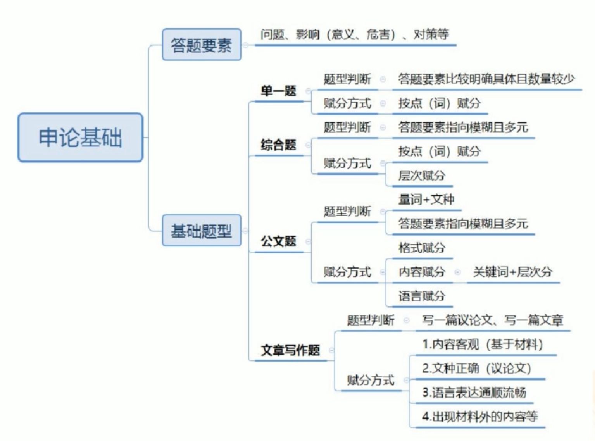
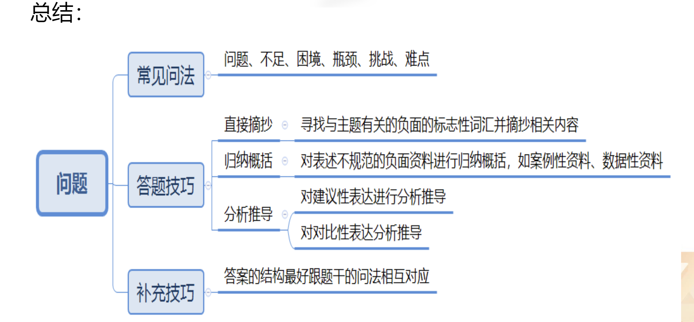

1. 申论考试大纲
2. 答题要素与基础题型
3. 申论答题步骤

# 申论考试大纲
1. 阅读理解能力
全面把握给定资料的相关内容，准确理解**给定资料**的含义，准确提炼**事实**所包含的观点并揭示所反映的本质问题。
2. 综合分析能力
对给定资料的全部或部分的内容、观点或问题进行**分析和归纳**，多角度地思考资料内容，作出合理的**推断或评价**。
3. 提出和解决问题能力
准确理解把握给定资料所反映的 问题，提出解决问题的措施或办法。
4. 文字表达能力
熟练使用指定的语种，运用说明、陈述、议论等方式，准确规范、简明畅达地表述思想观点。

**大纲总结**

1. 测查基本能力
2. 客观性的考试一"材料为王”
3. 答案要点部分需要我们通过归纳概括或分析推导资料得出
4. 答题语言准确规范反映资料原意即可，无需华丽辞藻

# 答题要素与基础题型

## 1.答题要素
问题、影响（危害、意义）、对策等。

## 2.基础题型
单一题、综合题、公文题，文章写作题。

### 单一题
- 题型判断
	- 要素指向明确且数量较少
	- 问题、原因、影响（意义、危害）、对策等
- 赋分方式
	- 按点（词）赋分

【例1】根据“指定资料1”，概括S市在乡风文明建设方面的<u>举措</u>
要求：全面、准确，不超过150字。

### 综合题

- 题型判断
要素指向模糊且多元
问题、原因、影响（意义、危害）、对策等
- 赋分方式
按点（词）赋分+层次赋分（要素分类回答）

【例2】“给定资料4”提到，“城市建设与管理的目的如果仅仅是为满足经济或某种美观诉求，显然是片面的，甚至是短视而危险的”。请根据“给定资料3”和“给定资料4”，谈谈你对这句话的<u>理解</u>。
要求：（1)观点明确，分析全面，有逻辑性；（2)不超过300字。

### 公文题

- 题型判断
量词+文种，要素指向模糊、种类较多
- 赋分方式
(1)格式赋分
(2)内容赋分：关键词+层次分
(3)语言赋分

【例3】假如你是某市团委工作人员，根据“给定资料5～6”，针对目前部分年轻人精神生活状况，围绕“充实学习生活，明确人生方向”，写一篇倡议书。
要求：格式正确，语言恰当，表述得体。不超过300字

### 文章写作题

- 题型判断：
一篇文章；一篇议论文
- 赋分方式：
内容客观（基于材料）
文种正确（议论文）
语言表达通顺流畅；
出现材料外的内容等。

【例4】请深入思考“给定资料5”画线句子“科学、艺术和古文化对于想象力都起着非常重要的作用，构成了想象力的源泉”，自拟题目，自选角度，联系实际，写一篇文章。(40分) 要求：（1)观点明确，见解深刻；(2)参考“给定资料”，但不拘泥于“给定资料”；（3)思路清晰，语言流畅；(4)字数1000~1200字。

## 总结

# 申论答题步骤

- 审题
- 阅读资料
- 组织答案

## 一、审题方法
1.审作答范围
2.审作答主题和结构
3.审作答要求

### 1.审作答范围
(1)根据、依据、结合、阅读给定资料X: 即范围在材料X。
(2)材料X中提到了：即范围重点在材料X, 但要兼顾全部材料，根据主题进行筛选。

【例1】根据给定资料2，概括H街道加强社区治理的主要措施。
【例2】给定资料3中提到“乡镇工作虽然忙、累、压力大，但也是我们无悔的选择”请你谈谈对这句话的理解。

### 2.审作答主题与结构
- 主题词：形容修饰要素的词
一般为专有名词、材料主要论述词、有概括性词、你很陌生的词
- 结构：答案呈现出来的状态
基于不同题型来确定

【例1】根据给定资料2，概括H街道加强社区治理的主要措施。
【例2】给定资料3中提到“乡镇工作虽然忙、累、压力大，但也是我们无悔的选择”请你谈谈对这句话的理解。

### 3.审答题要求
1. 常见要求：
**准确**：要点来自材料；优先使用材料中规范的原词原句，不规范的词句在尊重资料原意的基础上归纳概括。(口语转书面语)
**全面**：确保关键词无遗漏，宁滥勿缺。
**简明**：表述言简意赅，突出关键词，去掉修饰语，避免同义反复。

2. 特殊要求：
给定资料7介绍了D公司应对车市“发展新趋势”取得成功的一些做法，请从中归纳出若干条经验，以供其他企业借鉴。
要求：（1)分成几个方面，以“在.…方面，......。主要体现为.…” 的表达形式，分条列出；(2)准确全面，简洁明了；(3)不超过300字。

【例1】某美术馆正在策划艺术家黎明的作品展，请根据“给定资料4”，为这一作品展撰写一则导言。
要求：（1)围绕黎明的创作宗旨、作品材质及其艺术追求等方面作  答；（2)内容具体、层次分明、语言流畅；(3)不超过400字。

## 二、阅读材料

### 1. 摘抄
【例】根据给定资料，概括当前**我国企业在“走出去”** 中遇到的**问题**。
**资料**：中国人民大学农业与农村发展学院教授仇焕广对《环球时报》说，本世纪初中国企业刚刚开始海外购买土地时，国际舆论环境还相对比较宽松。2010年之后，中国农业企业“走出去”的<u>国际舆论环境</u>日益<u>恶化</u>，有关中国“资源掠夺论”的言论屡屡出现，<u>一些国家纷纷出台对中国农业投资不利、甚至带有歧视的政策。</u>

**答案**：国际舆论环境恶化，遭受歧视。

### 2. 概括归纳
【例2】阅读给定资料，概括L村在开展农村文化建设工作中实施了哪些举措。
L村<u>文化活动中心</u>成立后，村政府便迅速购买了一批<u>棋牌和健身器材</u>，极大的丰富了村民的业余生活。L村的<u>“农家书屋”</u>也正式落地，书屋中还<u>新配置</u>了社科类、农业科技类、医药卫生类等<u>书籍</u>，真正使书屋成为农民学科技、闯市场、快致富的“加油站”和好帮手，让新鲜多彩的先进文化进村入户。

棋牌和健身器材--概括为  文化设施
**答案**：成立文化活动中心，完善文化设施，开办“农家书屋”，丰富书籍种类

【例3】根据给定资料，概括出野生动物人工繁育产业的发展现状。（数据型材料）
根据调查估算，2016年，我国食用野生动物养殖产业的**从业者**约626.34万人，**总产值**1250.54亿元。其中两栖爬行类养殖从业人员101.7万人，年产值506.48亿元；爬行动物养殖从业人员501.13万人，年产值643.22亿元；鸟类养殖从业人员14.73万人，年产值76.56亿元；兽类养殖从业人员8.77万人，年产值24.28亿元。且从业者几乎遍布全国的所有省份。

**答案**：从业者众多、分布范围广，行业产值高。

**数据型材料：**
1. 定位数据主语（哪方面的数据）
2. 围绕主语分析数据背后含义
	1. 绝对值（通过很大/很小数字反应一个极值）
	2. 趋势上升/下降
	3. 比重（哪部分比重大/小）

**事例型资料：**
A：事例一般多为不规范语言，前后若有结论性句子，结论句是重点。
B：事例一般为叙事性表达，若无结论句，需概括提炼。
**数据型资料：**
A：数据本身非答案，前后若有结论性句子，结论句是重点。
B： 无结论性句子，一般可通过分析，用“多少、大小、高低、快慢、增减、比重”等词描述数量。

### 3. 分析推导

【例4】根据给定资料，归纳出我国网络安全发展方面存在的问题。
有律师表示，尽管我国有《国家安全法》《网络安全法》等，但这些相关法律只形成了个人信息保护政策的基本框架，而关于监管的范围、对象、内容、手段，以及执行机构、执法渠道等方面的内容还需要**进一步细化**。

答案：个人信息保护及监管政策不够细化

【例5】根据给定资料，分析指出我国控制过度包装工作存在的问题。
每年全国城市固体废弃物中，包装物占30%，每年废弃价值达4000亿元，而处理这些“美丽垃圾”费用更是惊人。而在英国，几年前曾在全国自下而上掀起了一场关于过度包装问题的热烈讨论；另外，以关心环保问题闻名的英国《独立报》还推出了一项“反包装浪费”活动，要求超市和零售商为各种商品“脱掉多余的外衣”。

答案：缺少反对过度包装的社会氛围，缺乏正确的媒体舆论导向

## 三、答案组织技巧
1. 加序号
常见的方法是在要点前添加“1.2.3.”或者“①②③”或者“一、二、三、”。
2. 分类整理
单一要素—按话题分
多要素—按要素分层

【例 1】根据给定资料 2，概括 H 街道加强社区治理的主要措施。 
【例 2】给定资料 3 中提到“乡镇工作虽然忙、累、压力大，但也是我们无 悔的选择”请你谈谈对这句话的理解。 

【解读】 
1. 第一题：单一题。按照不同的话题，分别进行整理。形成答案时候，按照 “龙摆尾”形式书写。 
2. 第二题：综合题。答案要素多，分段分层书写。
3. 单一题，答案按照话题分类。多元要素的公文题和综合题，要按照要素进 行分层

## 总结

【解读】
1. 拿到题目：先审题，审范围是否确定，不确定就用主题词筛选材料，然后， 审作答主题和结构，最后，审作答要求。 
2. 阅读材料：直接摘抄，归纳概括，分析推导，结合不同情况，交叉使用方 法。 
3. 答案组织技巧：答案要标序号，更加清晰地呈现出来，保证逻辑顺畅，按 照要素进行分类整理即可。 
4. 掌握题目类型，才有宏观的认知，做题过程中要注意哪些内容，在后续学 习中会逐一讲解，希望大家努力学习，提高分数。

# 问题类题目
- 常见问法
- 答题技巧
- 补充技巧

## 一、常见问法
1. 问题、不足、困境、瓶颈、挑战、难点等。
2. 问题是负面的表述，在问题类的表述中，经常会给出一个主题词+负面的问题类要素，要么明确给出问题这个字眼，或者问题的同义表述“不足、困境、 瓶颈、挑战、难点等”。给出主题词后，答题要素落在负面消极表述上。

**【例题展示】**
(2013国考地市级)根据"给定资料4~6”，慨括目前**汉语生态环境**面临的主要**问题**。
(2014国考副省级)给定资料2揭示了当前**社会心理方面**存在的若干**缺失**，请对此予以概括归纳。
(2019年吉林甲级)根据"给定资料2、3”，概括**我国民间智库**发展过程中面临的**困难**。

## 二、答题技巧
### 1. 摘抄(书面规范表达)
寻找**与主题有关**的**负面**的**标志性词汇**并摘抄相关内容，如：
不科学、不合理、不到位、不均衡、不完善、不健全、不足；
缺乏、缺少、流失；
少、低、差、弱；
陈旧、单一、阻碍、桎梏等。
- 以上仅仅是提示有问题表述，不能只摘抄提示词，要摘抄完整的问题 表述，例如，政策法律不完善，要加上名词（确切的事物）。
- 并不是所有的问题表述都要抄，不是所有的负面信息都抄上，要写有关主题的负面信息，要做到和主题的对照，概括我国民间智库发展中面临的问题，只寻找民间智库的问题，不是官方智库，半官方智库的问题。
- 摘抄规范和简洁的词汇，如果没有简洁的词汇，就需要归纳概括。
>特别强调：
>1. 抄完整结构。
>2. 基于主题之下的负面信息，要关注主题

### 2. 归纳概括
对表述不规范的负面资料进行归纳概括，如**数据型资料、案例型资料**等。
#### **(1)数据性资料**
【例】针对**博物馆、美术馆、科技馆、纪念馆和陈列馆**的调查数据显示，24.4%的**受访者一年中从未去过这5类场所**，61.6%的人平均每年去1到5次。而市民对**去文化馆的次数更低**，93.7%的人平均每年到馆5次以下，其中，58.6%的人没去过文化馆，35.1%的人每年到馆次数为1到5次。

>看到数据材料，不要盲目的摘抄数据，要看数据前后有无结论性的、总结性 的句子，有总结性的句子，就直接摘抄，没有总结性的句子，就自己概括背后的 信息，用多、少、大、小、高、低进行概括

资料： 
1. 文化场馆利用率低：这个概括不准确，过度脑补，利用率是来的人数和承 载人数存在差距，例如，能承载 1000 人的博物馆只来了 200 人，这样才能称作 文化场馆利用率低。 
2. “61.6%的人平均每年去 1 到 5 次……1 到 5 次”：强调去文化场馆的频 次低，参观的次数少，积极性差，意愿低，这些表示都可以
3. 注意：归纳概括后表意的精确性，语言表达可以是多种多样的，但是，不 可改变资料本意，表意一定要准确，要准确还原材料的意思。

本段资料可归纳概括为：市民参观**文化场馆**的次数少/**积极性差/意愿低**
注意：归纳概括后表意的精确性，不可改变资料本意

#### **(2)案例性资料**

>要看案例前后，有无总结性的句子，优先摘抄总结性的句子

【例】概括C市目前幼儿教育发展的问题。
王女士是该市的一位普通家长，她的孩子5岁，在当地一所民办幼儿园就读。幼儿园老师会号召班里的孩子们，孤立疏远那些“上课调皮”的孩子，不理他们，不和他们玩。

【解读】 
1. 先找幼儿教育的负面信息。 
2. “王女士是该市的……幼儿园就读”：出现主题词，幼儿园。
3. “幼儿园老师会号召班里的孩子们……不和他们玩”：表述不规范，直接 抄很长，归纳概括，教师师德差、道德素养低下。
4. 概括问题：教师师德差/师德缺失/道德素养低下。 
5. 注意：归纳概括需要储备一定数量的规范词。考试时候，如果想不到这些词汇，就需要储备一定数量的规范词和规范表达，学会迁移使用。这是长期的过程。

**概括问题**：教师师德差师德缺失/道德素养低下。

### 3.分析推导
对**建议型表达**或对**对比型表达**进行分析推导。

#### (1)对**建议型表达**进行分析推导
【解读】 
1. 分析推导建议性表达和对比性表达。
2. 建议型表达：希望某些人做某些事。例如，小明你该减肥了，这是我对小明的建议，提这个建议的言外之意是小明现在胖，要分析推导出问题

【例】(2019年吉林甲级)其实民间智库未来发展的空间非常广阔，民间智库可考虑拓展业务范围，例如从事电视节目收视率的调查、收视习惯分析研究、给企业和电视台提供完备的广告投放及营销企划服务等。

【解读】 
1. “其实民间智库未来发展的空间非常广阔，民间智库可考虑拓展业务范围”： 建议型表述，考虑拓展业务范围，具体的做法。由此可以知道，民间智库的业务 范围狭窄、单一 
2. “例如从事电视节目收视率的调查……服务等”：举例子说明业务范围。 
3. 分析推导出问题：民间智库业务范围狭窄/单一。

分析推导出问题：民间智库业务范围狭窄/单一

#### (2)对**对比型表达**进行分析推导
1. 横向对比：不同主体之间的对比
2. 纵向对比：同一主体不同时期的对比

【解读】 
1. 横向对比：不同主体之间的对比。例如，中国和美国相比，就是不同主体之间的比较。 
2. 纵向对比：同一主体不同时期的对比。例如，计划经济时期的中国和改革开放后的中国。就是同一主体不同时期的比较。 
3. 例如，小明你看小红学习多好，即小明学习成绩不好。

【例】概括我国进入汽车社会后面临的主要**困扰**。
在汽车普及已久的社会中，人们对汽车的兴奋度会大大下降，在调查中，中国消费者和欧美日韩还存在很大差异，欧美日韩对于汽车消费品趋于理性。日韩国家流行的是小排量，欧洲国家除了小排量就是旅行车，也都以家庭实用为主，欧洲人有买车计划的比例远不及中国，即便打算买车，购买二手车的比例也超过了买新车的比例。

【解读】 
1. 困扰：问题的同义词，指向的是负面信息。
2. “在汽车普及已久的社会中……欧美日韩对于汽车消费品趋于理性”： 欧美日韩对于汽车消费品趋于理性，对比可以知道，中国汽车消费不理性。
3. “日韩国家流行的是小排量……也都以家庭实用为主”： 日韩国家流行小排量，对比可以知道，中国喜欢大排量汽车。日韩家庭实用为主，对比可以知 道，中国汽车消费不以实用性为主。
4. “欧洲人有买车计划的比例远不及中国……购买二手车的比例也超过了买 新车的比例”：欧美买二手车，对比可以知道，中国喜欢购买新车。
5. 分析推导问题：中国消费者汽车消费不理性， 轻实用性，倾向新车、大 排量车。
6. 对比分析时候，不能改变材料的原意。

分析推导问题：中国消费者汽车消费不理性，轻实用性，倾向新车、大排量车

## 三、补充技巧
【例】（2014东国考副省)“给定资料2”揭示了当前社会心理方面存在的若干 “缺失”，请对此予以归纳概括。(10分)
要求：全面准确，分条归纳，不超过150字。

1.轻松感缺失。
2.公平感缺失
3.安全感缺失。
4.幸福感刻归属感缺失。

【参考答案讲解】
答题技巧：答案的结构最好跟题干的问法相互对应。
答案结构和题干问法相对应，要匹配题干，内容上进行批评，问啥答啥，不管内容还是形式，都要和题干进行对应
## 总结

# 影响类题目

什么是影响？ 
	影响是一个事物所引发的结果性信息 
	影响大致可以分成正面影响和负面影响

## 一、负面影响的常见问法及答题技巧

### 1.常见问法

负面影响的常见问法：危害、后果等。
（1）负面影响的常见问法：危害、后果等。 
（2）一般不会直截了当给出负面影响这四个字，会给出一些常见的问法， 危害、后果等。

**例题：**
（2016 年政法干警）概括过度依赖手机给人们带来的不良后果。
**分析**
（1）主题：过度依赖手机。 
（2）不良后果：落点在负面信息，不良后果是负面影响的同义表述。

### 2.答题技巧

1. 直接摘抄：一些标志性词汇构成的词组往往是影响的得分词。
2. 常见负面影响的标志性词汇有：降低了（降低了生活水平）、减少了、破坏了（破坏了生活环境）、阻碍了（阻碍了经济发展进程）、引发了、加重了、激化了等。
3. 不能只摘抄标志词，要摘抄完整的负面表述，消极影响的提示词+名词， 例如，降低了生活水平。

## 二、正面影响的常见问法及答题技巧

### 1.常见问法 
正面影响的常见问法：意义、效果、成果、积极作用等。 
这些都是正面影响的同义表述，只要看到这些词汇，就知道要考查正面的影响。

**例题**
（2015 年广东县级）简要概括 A 市推行权力清单制度取得的效果。 
（2016 年广东县级）说明“众创空间”对于推动“大众创业、万众创新” 的积极作用

**分析**
1. 主题：权力清单制度。 
2. 效果：正面影响的同义表述

### 2.答题技巧

#### 1.直接摘抄：

一些标志性词汇构成的词组往往是影响的得分词。
1. 常见正面影响的标志性词汇有：促进了（促进了经济发展）、改善了（改 善生活条件）、增加了（增加农民收入）、提高了、减轻了、实现了、弘扬了、节约了、保护了、方便了、倒逼（倒逼公民守信，通过外力逼着某人做某事，做的 是积极的事情）等。
2. 不能只摘抄标志词，要摘抄完整的正面影响的表述，动词+名词（形式）， 例如，改善了生活条件。
3. 注意：当资料中出现感情色彩为中性的提示词时，要结合具体信息点进行判断，如使得、引起、带来、产生等。例如，这些措施使得农村的面貌发生变化， 这里无法知道是好的变化，还是坏的变化。产生好的结果，还是产生坏的结果， 仅仅通过“产生”这个词汇是无法得到的，需要结合材料进行分析。

#### 2.通过问题进行推导

1. 对策解决了问题或者打算解决问题，可以将问题推导为相关对策的意义。
2. 例如，我现在太胖了，所以，我要去健身。太胖了是负面问题，通过健身摆脱肥胖，健身的意义是摆脱肥胖。
3. 注意：问题推导意义，要注意表述。健身的意义是摆脱肥胖，只保留了问题的核心名词肥胖，动词是自己加的（不唯一，有自由度，只要搭配合理即 可），因此，摆脱肥胖，解决肥胖难题

**例题**

1. 某地工业发展落后，产业结构不科学，针对这一问题，当地政府出台相关的扶持政策……。
**分析**
政策的意义：针对工业发展落后，产业结构不科学谈的，因此， 在这样的场景下，将问题推导意义，保留问题的核心名词（工业发展，产业结构）， 动词自己添加，推动/促进工业发展，完善/优化产业结构。这样的表述都是可以的

2. 某地工业发展落后，产业结构不科学，当地领导班子经过研究，重点发展 生态产业和休闲旅游产业。
**分析**
（1）发展生态产业和休闲旅游产业的意义不能写为推动/促进工业发展，完善/优化产业结构。 （2）揣摩语境：“工业发展落后，产业结构不科学”和“重点发展生态产业和休闲旅游产业”毫无关系。表述不明确，不是针对“工业发展落后，产业结构 不科学”提出的对策

**将问题推导成意义，要么对策解决了问题或者做法打算解决问题，有解决问题的意愿，只有这样，才能问题推导意义**

#### 3.通过目的进行推导

资料中出现表目的或目标的信息时，可推导为意义。

**常见的表目的和目标的提示词有：** 为了……、以……为目标等。

例：为了提升申论成绩，我坚持听课和练习。“为了”句式引导目的表述， 提升了申论成绩，就是坚持听课和练习的意义。

**注意**：表“目的”的灵活性，不仅仅是“为了”表目的，如该政策意在……， 本项目以……为主旨。大家要对目的的标志词汇有敏感度。

## 三、补充技巧

### 前因后果 
>先有原因，才会有发生的结果。前因后果，发生在事物之前的叫做原因，发生在事物之后的是结果，好的结果是正面影响，不好的结果是负面影响。

#### 巧用时间线
（1）关注资料中能提示时间线索的词汇。先有主题词，主题词之后的才是结果。 
（2）例如：之后……、以后……、而后……等。重点关注主题词之后发生的内容

**【例】** 概括 A 市推行权力清单制度取得的意义。 
去年年底，A 市完成了权力清单制度改革。现在，不少干部反映，各部门画出权力流程图，监控权力具体运行。

**【解读】** 
1. 主题：A 市推行权力清单制度。
2. 意义：正面的影响，要找正面的表述。
3. “去年年底，A 市完成了权力清单制度改革”：出现主题词，权力清单制度。
4. “现在……监控权力具体运行”：“现在”时间词汇，出现在主题词之后， 没有进行权力清单制度改革，就没有权力流程图，监控权力具体运行。
5. 答案：制定权力流程，监控权力具体运行

#### 找准参照系
**【例】** 他的身体一直都很好，但是最近家里有变故，一段时间生活不规律， 经常熬夜，吃饭饥一顿饱一顿，结果得了失眠和胃病，血压也高，这也让他没通过飞行员体检。 问题：他不健康造成的影响？他生活不规律的影响？ 
**【解读】** 
问题：他不健康造成的影响？
（1）失眠和胃病，血压也高：不健康的体现。
（2）这也让他没通过飞行员体检：“这”指的是失眠和胃病，血压也高，不健康造成的影响是没通过飞行员体检。

问题：他生活不规律的影响？ 
（1）主题词：生活不规律。 
（2）生活不规律，经常熬夜，吃饭饥一顿饱一顿：生活不规律的表现。 （3）生活不规律的影响：失眠、胃病、血压高（直接影响），没通过飞行员 体检（间接影响）。 

一样的材料，一样的问影响，答案不一样，关键在于主题不一样，参照系不一样。
技巧：找准参照系，定位主题词

## 影响类题目总结

【解读】 
1. 负面影响的常见问法和答题技巧：注意常见问法，以及答题技巧（直接摘抄），一定要摘抄完整，不能仅仅摘抄标志词。
2. 正面影响的常见问法和答题技巧：注意常见问法，正面影响的答题技巧比较多，可以直接摘抄，可以通过问题、目的推导，来源更加广泛。
3. 补充技巧： 
（1）前因后果：巧用时间线，关注主题词之后的内容。 
（2）找准参照系：定位主题，找准参照系。

# 原因类题目

## 一、题型判断

1. “原因”是引发“主题”的条件：原因是引发主题的一系列条件因素，因为什么带来什么结果，我坚持锻炼（原因），所以我减肥成功（结果）。一般是前因后果，先有原因，才有结果。 
2. 并非独立要素，其构成并不“固定”：例如，我申论考 85 分的原因，可能是努力刷题（对策做法），我聪明（品质、优势），我智商很高，身边父母支持（外在条件）。原因比较复杂，不像问题就找负面信息 ，对策直接找动词表述，问题和对策都是原因，做答指向不固定，每道题都不一样，因此，比较难一些。

**常见问法**：原因、动因（某个人做某件事的动机）、成因、理由、依据、根源；为什么等

【例 1】（2018 年江西卷） 根据“材料 3”，对乡村不良风气盛行的原因进行分析。

【例 2】（2020 年贵州 B 卷） 根据给定资料 1，分析为什么不必为智能化时代的就业问题过于担忧。

【例 3】（2020 年湖北乡镇卷） 根据给定资料 1，分析文中基层干部“忍不住流下眼泪”的主要因素。

【例 4】（2019 年河北乡镇卷）省有关部门公开征集“最美河北人”提名，假如推荐陈秀英，请根据资料 1， 列述推荐理由。

## 二、答题技巧

### （一）巧用情感色彩

>情感色彩上看，就两类，一类是好的事情分析原因，一类是不好的事情，分析原因。好事的原因也是好的，不好的事情的原因也是不好的。

主题及其原因情感色彩一致。正面事物的原因也是积极的，负面事物的原因也是消极的。

#### 1.正面原因 
当主题为正面事物时，它的原因通常指向能反映积极感情色彩的要点。可能会包括意义、优势、对策等。通过主题发现是好事，就关注材料中积极和正面的信息即可。

【例 1】（2019 年甘肃卷） 请根据“给定资料 2～3”，归纳概括老唐等基层干部能落实好上级政 策规定的主要原因。 
【解读】 
1. 能落实好上级政策规定，明显是好事，原因也是正面和积极的。可能是干 部能力强，对政策了解比较清楚，做出了努力，原因也是正面和积极的，重点关 注表意积极的信息。 
2. 可能包含意义、优势和对策。结果也可以作为原因。 
	（1）我坚持锻炼的原因，是因为锻炼能保持身体健康，锻炼能保持身体健 康是意义，也是坚持锻炼的原因。 
	（2）能够考上好大学的原因是他智商高，智商高是优势，也是考上好大学 的原因。 
	（3）能够考上好大学的原因是他努力学习，努力学习是对策，也是考上大 学的原因。

#### 2.负面原因
当主题为负面事物时，它的原因通常指向能反映消极感情色彩的要点。一般在材料中以问题的形态呈现。

1. 好的事情的原因是好的，不好的事情的原因是不好的。当主题为负面事物时，它的原因通常指向能反映消极感情色彩的要点。一般在材料中以问题的形态呈现。 
2. 例如：水污染严重是不好的结果，是负面的事物，其原因是水污染处理技术不够，是污染企业乱排乱放，污染水源，这些都是负面的问题，因此，这些负面问题是导致水污染严重的原因。要关注材料中的负面消极信息。

【例 2】（2018 年江西卷） 根据“材料 3”，对乡村不良风气盛行的原因进行分析。 
【解读】 乡村不良风气是不好的事情，因此，要从材料中找负面消极的问题和表述。 
材料： 
留守老人的赡养问题愈加突出，打工人员长期不管不顾家中老人的现象越来 越多，有的子女对老人的赡养相互推诿扯皮、引发纠纷；有的子女图安逸、求享 受，而家中老人还在为了生计起早贪黑干农活。 
材料： 
1. “赡养问题”：问题。 
2. “子女图安逸、求享受”：问题。
3. “不管不顾家中老人的”：问题。
4. 不好的事情的原因也是负面消极表述，可以通过问题呈现

#### 3.特殊情况

【例 3】（2020 年云南乡镇卷） 根据给定资料 1，分析民警小童采用特别的微信头像的原因。
【解读】 
1. 有些题目无法从题干判断情感色彩。
2. 特别的微信头像：这个头像是好是坏，从题干中无法判断出来。

### （二）关注因果标志词

- 因为、根源在于、究其原因、由于、源自、来自、背后、随着…… 
- 带来、使得、将会、引发、导致、这就有了……
- 原因可能在前面，可能在后面，因此，要关注材料。

【例】 从经济社会整体来看，人们不必为智能化时代的就业问题过于担忧，因为更多新的职业、新的就业形态将应运而生。
【解读】
1. 更多新的职业、新的就业形态将应运而生（原因）。 
2. 改变表述：人们不必为智能化时代的就业问题过于担忧，根源在于/究其 原因/背后是更多新的职业、新的就业形态将应运而生。 
3. 出现“因为、根源在于、究其原因、由于、源自、来自、背后、随着……”， 关注其后面的词汇。

【例】双龙镇目前大龄单身青年众多，除居住条件差等客观因素外，也有部分是游 手好闲、喝酒打牌造成的。 
【解读】 
1. 原因：居住条件差、游手好闲、喝酒打牌。
2. 结果：双龙镇目前大龄单身青年众多。
3. 双龙镇目前大龄单身青年众多，是游手好闲、喝酒打牌引发的、导致的。

### （三）关注时间先后

- 之前、之后、以后、而后等
- 原因先于主题发生，结果后于主题发生，这其中暗含因果逻辑。

【例】 此前，该市常年外出务工达 50 多万人，伴随而来的农村“三留守”难题至 今尚未得到有效破解。 、
【解读】 先有外出务工人员多（原因），带来的结果是农村“三留守”。

## 原因类题目总结：

### 梳理
1. 原因是先于主题发生的，是引发主题的条件因素。 
2. 原因不是独立的要素，构成不固定，问题、意义、危害、对策等都是原因。 
3. 常见问法：原因、动因、成因、理由、依据、根源；为什么等。出现这些 问法，就要考虑原因要素。
4. 方法：
	（1）巧用情感色彩，主题和原因的情感色彩一致，好事的原因是好的，坏 事的原因是坏的，根据情感色彩进行大致的预判。
	（2）关注因果标志词。 
	（3）关注时间先后：时间先后暗含逻辑关联词。

