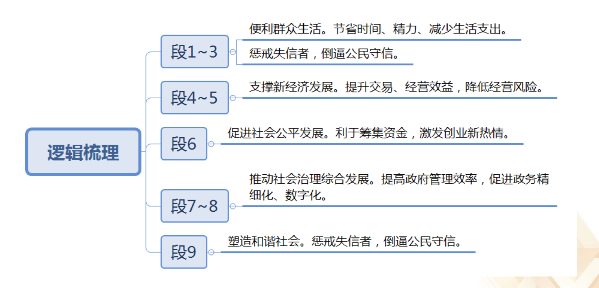
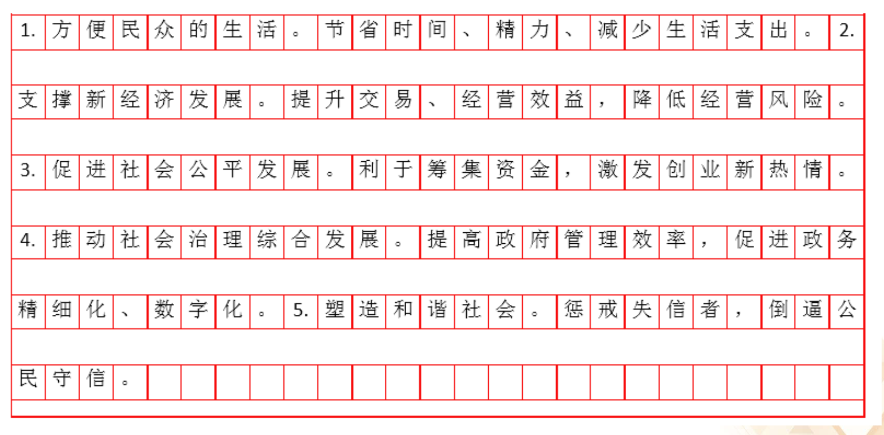

1. 问题类题目
2. 影响类题目
3. 原因类题目

# 问题类题目
**单一题答题形式要求：**
【例】
根据“给定资料2”概括Q集团俄罗斯公司成功打开国际市场的主要举措。（15分)
要求：（1)准确全面；(2)简明扼要；(3)分条陈述；(4)不超过200字。

**参考答案：**
1. **推出中国书架。** 扩大入驻城市范围，迅速扩张，发展合作书店。
2. **抓住历史机遇**。利用一带一路带来的汉语热、中国热，翻译、销售中国主题图书。
3. **定位本土化**。组建本土团队，利用纯母语思维和文化视角组稿、翻译、发行、推广，贴近本国读者。
4. **打造文化中心**。开展中国主题公益文化活动，吸引文化爱好者，增加流量。

【例1】2019年山东B卷
根据“给定资料2”，分析C市目前幼教育发展的主要问题。（20分)
要求：分析金面、准确，条理清晰；不超过300字

- 概括问题的时候要重点关注负面表述，比如标志词“少、低、差、弱、缺失、流失”等，关注负面信息，可能会有要点。
- 重点关注建议类的表达，比如C市在幼儿教育中需要注意投入更多的资金，可能说明现在没有更多的资金。如果说政府在去年投入三亿的资金，这不是问题。
- 对比类的资料也很重要，比如同一个事物不同时期的对比、不同事物的对比，重点关注这些，其他材料不可能出信息点。判断出题型后就可以运用做题方法和做题技巧推导，这就是方法前置，把做题方法前置到审题的阶段进行分析。

**题目复盘——答题技巧篇**
逻辑梳理意识：以段落为单位，梳理资料话题；段落间话题比对
前置词（逻辑词）一一如何得出：
本题中：
1. 总分关系（词义、设问）
2. 强调词(“大”难题)
3. 承接词

# 影响类题目

“主题”带来的作用或改变
从时间上看：影响通常发生在主题之后 

**思考：**
影响（意义/危害）究竟是什么？
影响和其他要素有着明确界限？

>影响就是某件事物有主题所带来的的连锁反应，影响发生在主题之后、影响就是主题带来的连锁反应。一般来说一个好事、积极正面的事物带来的影响就是好的，一个负面事物带来的影响是不好的。

请根据"给定资料2”概括信用体系建设对当前社会具有的积极影响。(15分)
要求：（1)准确全面；（2)分条概括；（3)不超过150字。
 
**思考&整理：**
预判（方法前置）：时间维度；标志词推导
逻辑梳理意识：以段落为单位，梳理资料话题; 段落间话题比对

