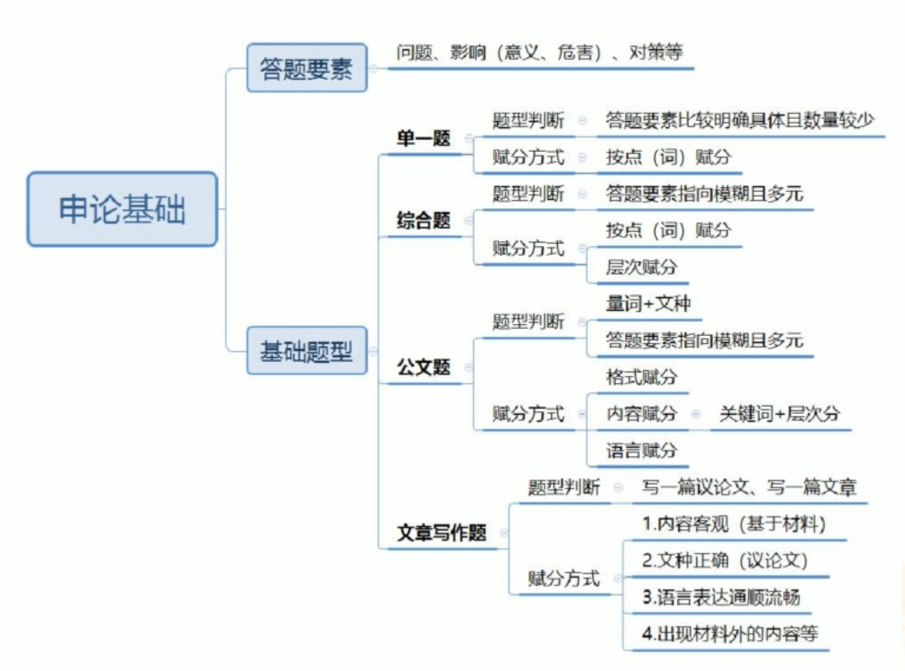
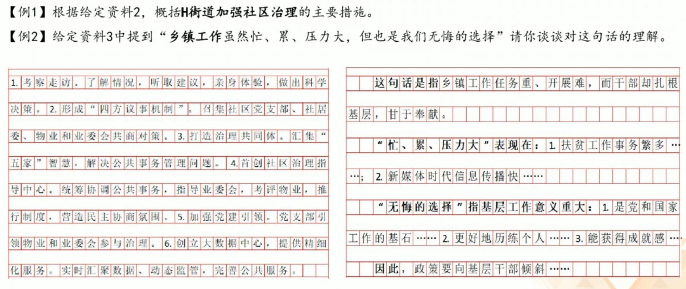
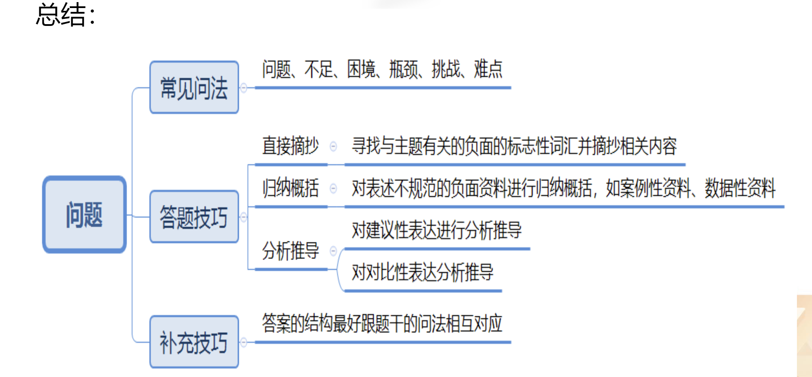

1. 申论考试大纲
2. 答题要素与基础题型
3. 申论答题步骤

# 申论考试大纲
1. 阅读理解能力
全面把握给定资料的相关内容，准确理解**给定资料**的含义，准确提炼**事实**所包含的观点并揭示所反映的本质问题。
2. 综合分析能力
对给定资料的全部或部分的内容、观点或问题进行**分析和归纳**，多角度地思考资料内容，作出合理的**推断或评价**。
3. 提出和解决问题能力
准确理解把握给定资料所反映的 问题，提出解决问题的措施或办法。
4. 文字表达能力
熟练使用指定的语种，运用说明、陈述、议论等方式，准确规范、简明畅达地表述思想观点。

**大纲总结**

1. 测查基本能力
2. 客观性的考试一"材料为王”
3. 答案要点部分需要我们通过归纳概括或分析推导资料得出
4. 答题语言准确规范反映资料原意即可，无需华丽辞藻

# 答题要素与基础题型

## 1.答题要素
问题、影响（危害、意义）、对策等。

## 2.基础题型
单一题、综合题、公文题，文章写作题。

### 单一题
- 题型判断
	- 要素指向明确且数量较少
	- 问题、原因、影响（意义、危害）、对策等
- 赋分方式
	- 按点（词）赋分

【例1】根据“指定资料1”，概括S市在乡风文明建设方面的<u>举措</u>
要求：全面、准确，不超过150字。

### 综合题

- 题型判断
要素指向模糊且多元
问题、原因、影响（意义、危害）、对策等
- 赋分方式
按点（词）赋分+层次赋分（要素分类回答）

【例2】“给定资料4”提到，“城市建设与管理的目的如果仅仅是为满足经济或某种美观诉求，显然是片面的，甚至是短视而危险的”。请根据“给定资料3”和“给定资料4”，谈谈你对这句话的<u>理解</u>。
要求：（1)观点明确，分析全面，有逻辑性；（2)不超过300字。

### 公文题

- 题型判断
量词+文种，要素指向模糊、种类较多
- 赋分方式
(1)格式赋分
(2)内容赋分：关键词+层次分
(3)语言赋分

【例3】假如你是某市团委工作人员，根据“给定资料5心6”，针对目前部分年轻人精神生活状况，围绕“充实学习生活，明确人生方向”，写一篇倡议书。
要求：格式正确，语言恰当，表述得体。不超过300字

### 文章写作题

- 题型判断：
一篇文章；一篇议论文
- 赋分方式：
内容客观（基于材料）
文种正确（议论文）
语言表达通顺流畅；
出现材料外的内容等。

【例4】请深入思考“给定资料5”画线句子“科学、艺术和古文化对于想象力都起着非常重要的作用，构成了想象力的源泉”，自拟题目，自选角度，联系实际，写一篇文章。(40分) 要求：（1)观点明确，见解深刻；(2)参考“给定资料”，但不拘泥于“给定资料”；（3)思路清晰，语言流畅；(4)字数1000~1200字。

## 总结

# 申论答题步骤

- 审题
- 阅读资料
- 组织答案

## 一、审题方法
1.审作答范围
2.审作答主题和结构
3.审作答要求

### 1.审作答范围
(1)根据、依据、结合、阅读给定资料X: 即范围在材料X。
(2)材料X中提到了：即范围重点在材料X, 但要兼顾全部材料，根据主题进行筛选。

【例1】根据给定资料2，概括H街道加强社区治理的主要措施。
【例2】给定资料3中提到“乡镇工作虽然忙、累、压力大，但也是我们无悔的选择”请你谈谈对这句话的理解。

### 2.审作答主题与结构
- 主题词：形容修饰要素的词
一般为专有名词、材料主要论述词、有概括性词、你很陌生的词
- 结构：答案呈现出来的状态
基于不同题型来确定

【例1】根据给定资料2，概括H街道加强社区治理的主要措施。
【例2】给定资料3中提到“乡镇工作虽然忙、累、压力大，但也是我们无悔的选择”请你谈谈对这句话的理解。

### 3.审答题要求
1. 常见要求：
**准确**：要点来自材料；优先使用材料中规范的原词原句，不规范的词句在尊重资料原意的基础上归纳概括。(口语转书面语)
**全面**：确保关键词无遗漏，宁滥勿缺。
**简明**：表述言简意赅，突出关键词，去掉修饰语，避免同义反复。
2. 特殊要求：

给定资料7介绍了D公司应对车市“发展新趋势”取得成功的一些做法，请从中归纳出若干条经验，以供其他企业借鉴。
要求：（1)分成几个方面，以“在.…方面，......。主要体现为.…” 的表达形式，分条列出；(2)准确全面，简洁明了；(3)不超过300字。

【例1】某美术馆正在策划艺术家黎明的作品展，请根据“给定资料4”，为这一作品展撰写一则导言。
要求：（1)围绕黎明的创作宗旨、作品材质及其艺术追求等方面作  答；（2)内容具体、层次分明、语言流畅；(3)不超过400字。

## 二、阅读材料

### 1. 摘抄
【例】根据给定资料，概括当前**我国企业在“走出去”** 中遇到的**问题**。
**资料**：中国人民大学农业与农村发展学院教授仇焕广对《环球时报》说，本世纪初中国企业刚刚开始海外购买土地时，国际舆论环境还相对比较宽松。2010年之后，中国农业企业“走出去”的<u>国际舆论环境</u>日益<u>恶化</u>，有关中国“资源掠夺论”的言论屡屡出现，<u>一些国家纷纷出台对中国农业投资不利、甚至带有歧视的政策。</u>

**答案**：国际舆论环境恶化，遭受歧视。

### 2. 概括归纳
【例2】阅读给定资料，概括乱村在开展农村文化建设工作中实施了哪些举措。
L村<u>文化活动中心</u>成立后，村政府便迅速购买了一批<u>棋牌和健身器材</u>，极大的丰富了村民的业余生活。L村的<u>“农家书屋”</u>也正式落地，书屋中还<u>新配置</u>了社科类、农业科技类、医药卫生类等<u>书籍</u>，真正使书屋成为农民学科技、闯市场、快致富的“加油站”和好帮手，让新鲜多彩的先进文化进村入户。

棋牌和健身器材--概括为  文化设施
**答案**：成立文化活动中心，完善文化设施，开办“农家书屋”，丰富书籍种类

【例3】根据给定资料，概括出野生动物人工繁育产业的发展现状。（数据型材料）
根据调查估算，2016年，我国食用野生动物养殖产业的**从业者**约626.34万人，**总产值**1250.54亿元。其中两栖爬行类养殖从业人员101.7万人，年产值506.48亿元；爬行动物养殖从业人员501.13万人，年产值643.22亿元；鸟类养殖从业人员14.73万人，年产值76.56亿元；兽类养殖从业人员8.77万人，年产值24.28亿元。且从业者几乎遍布全国的所有省份。

**答案**：从业者众多、分布范围广，行业产值高。

**数据型材料：**
1. 定位数据主语（哪方面的数据）
2. 围绕主语分析数据背后含义
	1. 绝对值（通过很大/很小数字反应一个极值）
	2. 趋势上升/下降
	3. 比重（哪部分比重大/小）

1. **事例型资料：**
A：事例一般多为不规范语言，前后若有结论性句子，结论句是重点。
B：事例一般为叙事性表达，若无结论句，需概括提炼。
2. **数据型资料：**
A：数据本身非答案，前后若有结论性句子，结论句是重点。
B： 无结论性句子，一般可通过分析，用“多少、大小、高低、快慢、增减、比重”等词描述数量。

### 3. 分析推导

【例4】根据给定资料，归纳出我国网络安全发展方面存在的问题。
有律师表示，尽管我国有《国家安全法》《网络安全法》等，但这些相关法律只形成了个人信息保护政策的基本框架，而关于监管的范围、对象、内容、手段，以及执行机构、执法渠道等方面的内容还需要**进一步细化**。

答案：个人信息保护及监管政策不够细化

【例5】根据给定资料，分析指出我国控制过度包装工作存在的问题。
每年全国城市固体废弃物中，包装物占30%，每年废弃价值达4000亿元，而处理这些“美丽垃圾”费用更是惊人。而在英国，几年前曾在全国自下而上掀起了一场关于过度包装问题的热烈讨论；另外，以关心环保问题闻名的英国《独立报》还推出了一项“反包装浪费”活动，要求超市和零售商为各种商品“脱掉多余的外衣”。

答案：缺少反对过度包装的社会氛围，缺乏正确的媒体舆论导向

## 三、答案组织技巧
1. 加序号
常见的方法是在要点前添加“1.2.3.”或者“①②③”或者“一、二、三、”。
2. 分类整理
单一要素—按话题分
多要素—按要素分层

## 总结

# 问题类题目
- 常见问法
- 答题技巧
- 补充技巧

## 一、常见问法
问题、不足、困境、瓶颈、挑战、难点等。

**【例题展示】**
(2013国考地市级)根据"给定资料4~6”，慨括目前**汉语生态环境**面临的主要**问题**。
(2014国考副省级)给定资料2揭示了当前**社会心理方面**存在的若干**缺失**，请对此予以概括归纳。
(2019年吉林甲级)根据"给定资料2、3”，概括**我国民间智库**发展过程中面临的**困难**。

## 二、答题技巧
### 1. 摘抄(书面规范表达)
寻找**与主题有关**的**负面**的**标志性词汇**并摘抄相关内容，如：
不科学、不合理、不到位、不均衡、不完善、不健全、不足；
缺乏、缺少、流失；
少、低、差、弱；
陈日、单一、阻碍、桎梏等。

>特别强调：
>1. 抄完整结构。
>2. 基于主题之下的负面信息，要关注主题

### 2. 归纳概括
对表述不规范的负面资料进行归纳溉括，如**数据型资料、案例型资料**等。

**(1)数据性资料**
【例】针对**博物馆、美术馆、科技馆、纪念馆和陈列馆**的调查数据显示，24.4%的**受访者一年中从未去过这5类场所**，61.6%的人平均每年去1到5次。而市民对**去文化馆的次数更低**，93.7%的人平均每年到馆5次以下，其中，58.6%的人没去过文化馆，35.1%的人每年到馆次数为1到5次。

本段资料可归纳概括为：市民参观**文化场馆**的次数少/**积极性差/意愿低**
注意：归纳概括后表意的精确性，不可改变资料本意

**(2)案例性资料**
【例】概括C市目前幼儿教育发展的问题。
王女士是该市的一位普通家长，她的孩子5岁，在当地一所民办幼儿园就读。幼儿园老师会号召班里的孩子们，孤立疏远那些“上课调皮”的孩子，不理他们，不和他们玩。
**概括问题**：教师师德差师德缺失/道德素养低下。

### 3.分析推导
对**建议型表达**或对**对比型表达**进行分析推导。

(1)对**建议型表达**进行分析推导

【例】(2019年吉林甲级)其实民间智库未来发展的空间非常广阔，民间智库可考虑拓展业务范围，例如从事电视节目收视率的调查、收视习惯分析研究、给企业和电视台提供完备的广告投放及营销企划服务等。

分析推导出问题：民间智库业务范围狭窄/单一

(2)对**对比型表达**进行分析推导
1. 横向对比：不同主体之间的对比
2. 纵向对比：同一主体不同时期的对比

【例】概括我国进入汽车社会后面临的主要**困扰**。
在汽车普及已久的社会中，人们对汽车的兴奋度会大大下降，在调查中，中国消费者和欧美日韩还存在很大差异，欧美日韩对于汽车消费品趋于理性。日韩国家流行的是小排量，欧洲国家除了小排量就是旅行车，也都以家庭实用为主，欧洲人有买车计划的比例远不及中国，即便打算买车，购买二手车的比例也超过了买新车的比例。

分析推导问题：中国消费者汽车消费不理性，轻实用性，倾向新车、大排量车

## 三、补充技巧
【例】（2014东国考副省)“给定资料2”揭示了当前社会心理方面存在的若干 “缺失”，请对此予以归纳概括。(10分)
要求：全面准确，分条归纳，不超过150字。

1.轻松感缺失。
2.公平感缺失
3.安全感缺失。
4.幸福感刻归属感缺失。

答题技巧：答案的结构最好跟题干的问法相互对应。

## 总结

