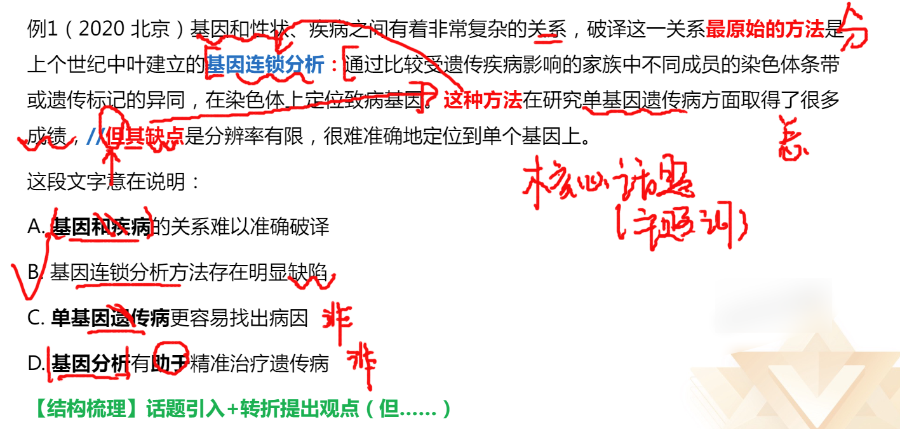
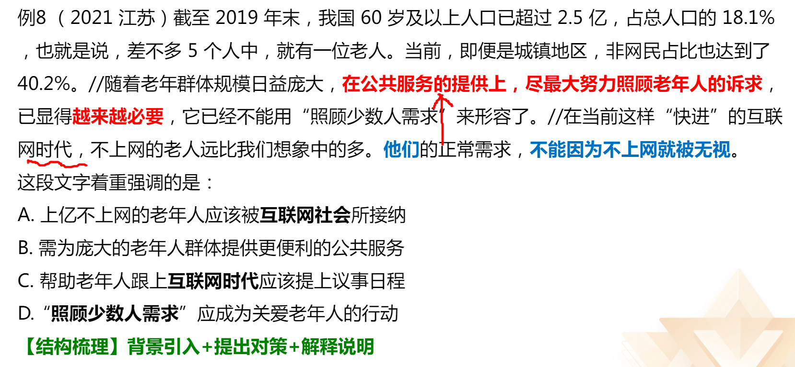

# 基础知识
## 提问方式

- 这段文字主要/旨在/重在/意在/想要说明（论述/强调)的是.…
- 这段文字的主旨/主题观点是.…
- 对这段文字概括最恰当的是.…
- 这段文字表达了作者.…
- 从这段文字中我们可以看出作者的意图/态度是.…
- 适合做这段文字关键词的是.…

## 解题思路

- 有中心句-同义替换 （选项核心话题=文段主题词，两个替换看意思是否相同）
- 无中心句-全面概括 （全段无主次之分，概括提取共性）

## 解题技巧

**找中心句：**
- 重点词语 （关联词、主题词、程度词）
- 行文脉络 （文段结构：总分、分总、并列）

# 一、重点词语

## 关联词

### 转折关系

转折词：虽然......但是......; 尽管......可能；......不过......；......然而......；......却......；
	其实/事实上/实际上

理论要点：转折之后是重点

解题思路，找转折，找主题词，选项里找主题词。

#### 转折常考结构

1. 好+转折+坏
2. 表面上看+转折+实质
3. 引入+转折提出观点+解释说明

**错误选项特征：**
1. 转折前的内容
2. 围绕例子的表述
3. 无中生有

**略读句子特征：**
例子：比如、例如、诸如、譬如
原因：因为、由于、：、——等
背景：近年来、随着、在......背景下

### 因果关系

**典型格式：** 因为......所以......
	由于......因此......

**理论要点：** 结论是重点

引导结论的标志词：
1. 所以、因此、因而、故而、于是、可见、看来、故
2. 导致、致使、使得、造成

若尾句出现结论词，大部分情况下是对前文的总结，尾句通常为文段的中心句。

  
  

结论句出现在文段开头/中间，之后仍有其他语句
1. 之后的语句是进一步解释说明，此时中心句仍为结论句
	Eg. 公司福利待遇很好，所以我胖了。比如去年的衣服今年穿不上了。
2. 之后又出现并列、因果、转折，需结合多种关联词共同分析
	Eg. 因为考试前一天晚上没有休息好，所以考试没有发挥好。但是，我上岸了~

## 主题词

**定义：** 文段围绕的核心话题，文段要围绕其展开

 **判断方法：**
1. 中心句围绕的核心话题，一般前有引入后又解释说明（主题词出现频率低，中心句中找）
	例：在从猿到人的进化过程中，人们考虑到地理、气候、动植物资源等因素是完全正确的。但在禄丰古猿、东方人、元谋人生存的区域内有丰富的盐泽，不能不促使我们去思考盐在从猿到人进化中的作用。吃熟食易消化，促进原始人类的进步；古猿食盐促进食物消化，促进营养合成,增强古猿体质，从而提高了古猿的生存能力，促进了古猿的进化，也是合乎逻辑的。 
2. 每一句话都围绕的相同话题（主题词高频出现，但高频词不一定是主题词，只在非中心句出现的高频词）
	例：小时候，乡愁是一枚小小的邮票，我在这头，母亲在那头。长大后，乡愁是一张窄窄的船票，我在这头，新娘在那头。后来啊，乡愁是一方矮矮的坟墓，我在外头，母亲在里头。而现在，乡愁是一湾浅浅的海峡，我在这头，大陆在那头。

理论要点：正确答案需包含文段主题词 (干扰项：偷换、扩大、缩小、片面)

         

 

### 主题词总结

## 关联词-必要条件关系

**典型格式：** 只有......才......

**理论要点：** 
- 必要条件是重点
- 必要条件 ”只有“ 和 ”才“ 之间的部分 （只有可以省略，注意才）

### 对策引导词：

#### 对策标志词
1. 应该、应当、必须、需要、应、须、要+做法
2. 通过/采取......手段/途径/措施/方式/方法/渠道，才能......
3. 前提、基础、保障
4. 负有..的义务/.…的必由之路/.…的法门之一/要领在于/势在必行

#### 问题标志词
- 挑战、瓶颈、软肋、难题、不足、缺陷、风险等

#### 对策行文脉络
1. 提出问题+分析问题+解决问题
2. 提出问题+解决问题+解释说明（意义效果）
3. 对策+正反论证/原因论证/举例论证

### 反面论证

>当反面论证前面有问题时，反面论证可以充当对策，如果前面是观点时，就不行

 #### 典型格式
- 如果/倘若/一旦…+不好的结果

#### 具体应用
- 把前面的做法反过来，即为正确答案

**举个小例：** 现在题目难度越来越高。如果你不掌握正确的方法，那么就会做错。
	掌握正确的方法

**【知识链接】：**
当文段中只出现“问题”表述时，“解决问题”可能会作为正确答案出现在选项里。

注意：对策不万能，要有针对性！

举个小例：过量饮酒不好…
A.饮酒要适度
B.过量吹酒不好
C.应该多抽烟

### 必要条件总结

 ## 程度词

**典型标志词：** 更、尤其、正是、特别是、真正、根本、最核心、最突出等

**非典型标志词：** 深为.…倾倒、罪魁祸首、致命、堪比、极具特色等

**理论要点：** 程度词可提示重点位置

举个小例： 小张能有今天的成绩，主要依靠强大的团队，特别是他的导师。

### 程度词总结

## 并列关系

**理论要点：** 全面概适（之间没有主次之分，要全面概括）

**文段特征：**
1. 包含并列美联词，如此外、另外、同时、以及、
2. 句式相同或相近
3. 按照时间顺序展开(前提为话题一致)

错误选项特征：表述片面

为官要善为，”法”字当头做功课；
为官要敢为，“干”字为要抓效率；
为官要有为，"好”字为纲惠民生。  

落在“细”上，坚持细处着眼、润物无声；
落在“小”上，注重小处着手、以小见大，
落在“实”上，倡导实处着力、知行合一。

在思想感情上，要体现一个“爱”字；
在自身形象上，要树立一个"正”字；
在工作方法上，要突出一个“细”字
在工作作风上，要坚持一个“实”字；
在领导力量上，要形成一个“合”字。

#### 时间顺序展开的并列VS古今对比
**时间顺序展开的并列：** 多为三个或以上几方面，且无其他关联词引导
夏朝..；商朝.；秦朝.；东汉…
早期此后.…如今…
第一次..第二次…第三次..第四次

**古今对比：** 两个方面，且有转折/程度词表强调（重点放在转折后）
过去.现在则是..
以往但是今天…

### 并列关系总结

## 把握中心句及分述句的特点

**中心句特征：**

- 形式：重点词提示（关联词、程度词）
- 内容：观点（结论、对策、评价）

**分述句特征：**   

1. 举例子：“比如”、“例如”、“.…就是例证”等
2. 数据资料
3. 正反论证（前文有问题时，反面论证可以是对策）
4. 原因解释
5. 并列分述

**总——分（观点+解释说明）**
中心句后为不同类型的解释说明

### 分总

1、结论、对策

2、代词(“这”“此”)引导的尾句需关注

**常考标志词**
对此/有鉴于此/尽管如此/在这个意义上/从这个角度来说等
总之、换言之、简而言之、换句话说  

### 中心句分述句总结

