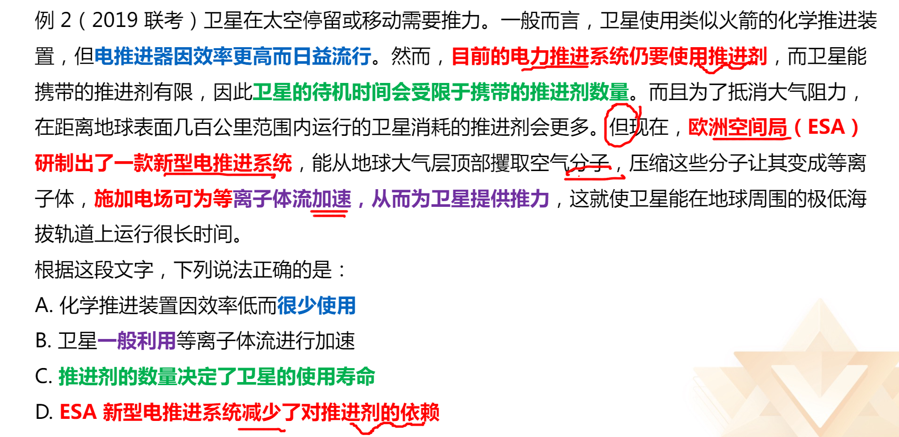
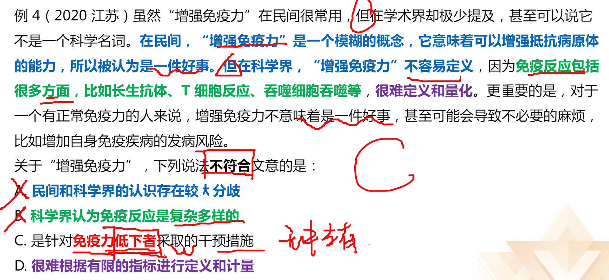
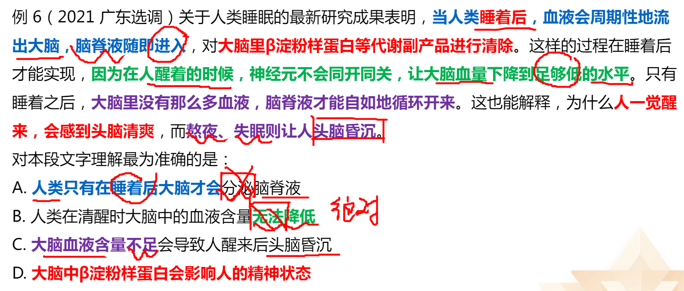
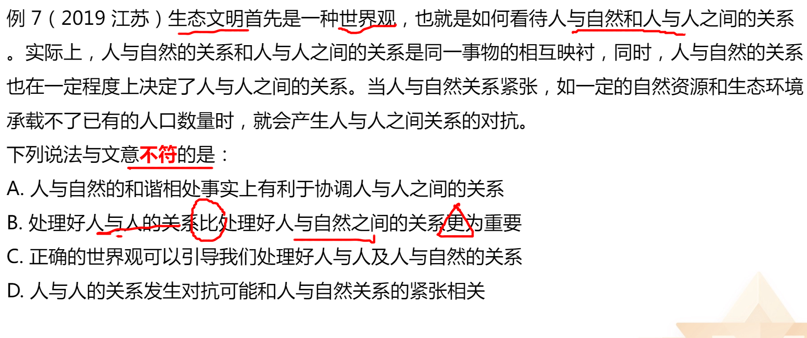
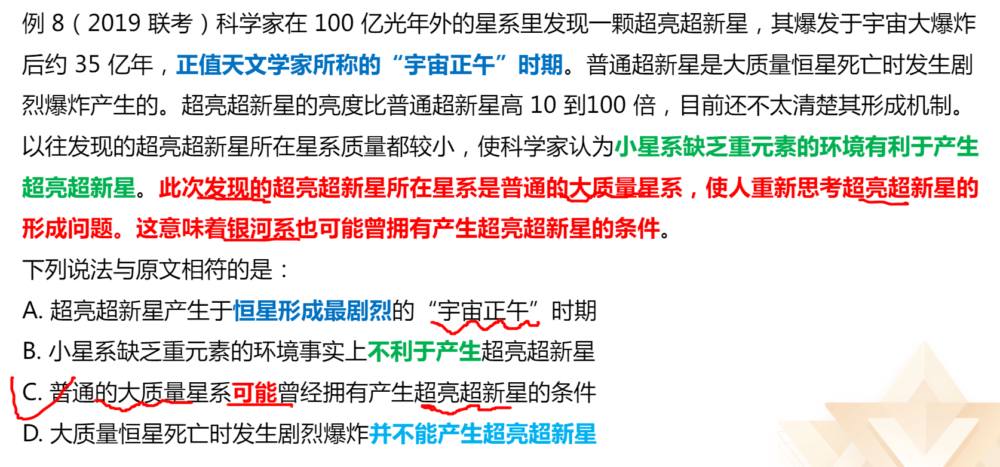
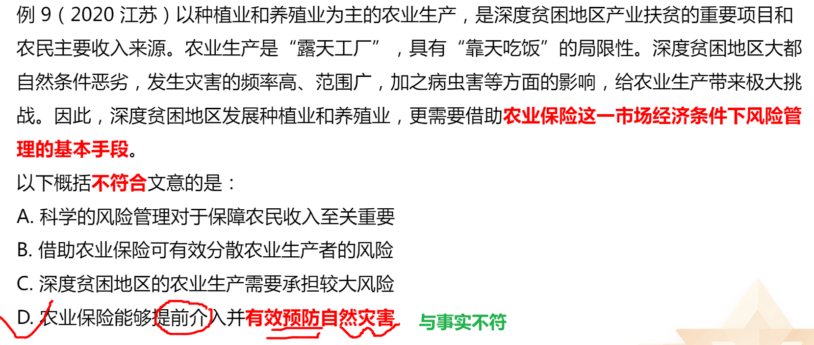
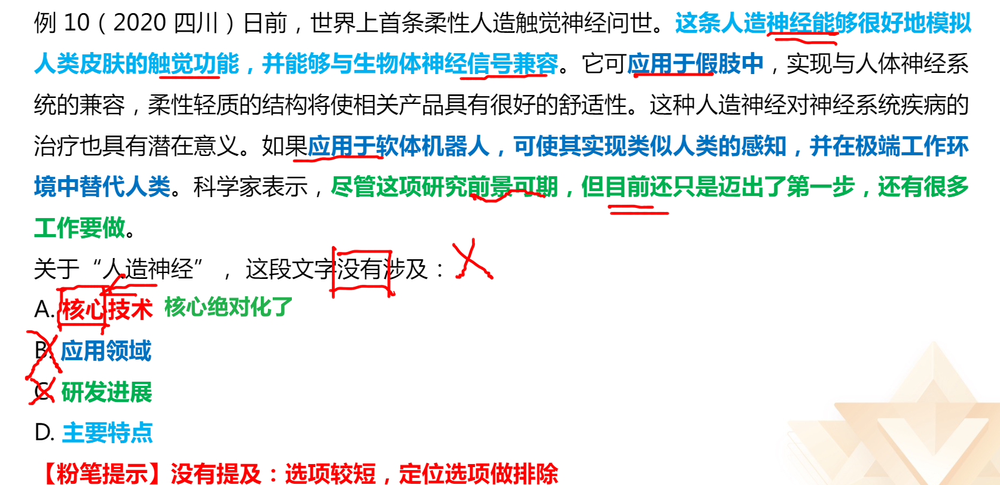
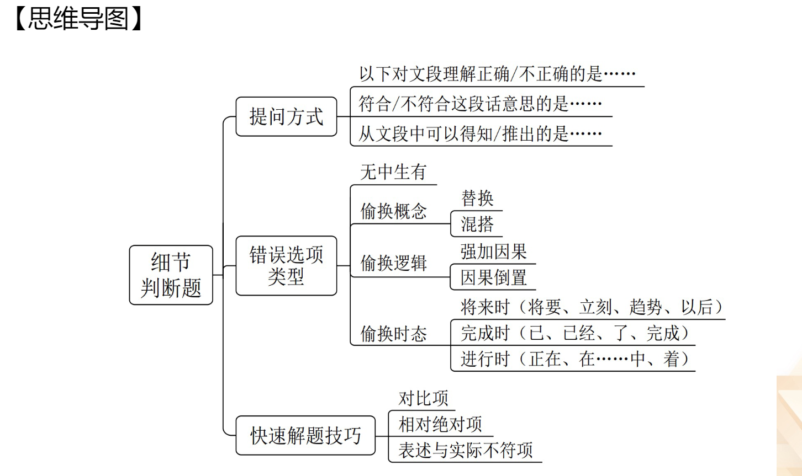

#### **提问方式：**

“以下对文段理解正确/不正确的是”
“符合/不符合这段话意思的是”
“从文段中可以得知/推出的是”等

#### **做题顺序建议：**

1. 从文段特征看：
	文段晦买难懂：建议先看选项，再回到文段做比对文段通俗易懂：可以先读文段，再看选项
2. 从选项特征看：
	选项特征明显，可以先从选项入手

#### **易定位特征：**

三字一号”：数字、名字、字母、标点符号
核心名词：
- 孤雌生殖或依赖雌性特有化学信号
- 使用超材料能够反弹雷达波

#### **错误选项类型：**
1. 无中生有
2. 偷换概念（替换、混搭) 
3. 偷换逻辑（强加因果、因果倒置)
4. 偷换时态
	将来时（将要、立刻、趋势、以后）
	完成时（已、已经、了、完成）
	进行时（正在、在..中、着、尚未完成)

 

#### 快速解题技巧

1. 对北比项
	标志词：A比B更.…
	A高于/优于B
	利大于弊

举个小例：小张自认为腿长，小龙腿特长。
小龙比小张的腿更长。

2. 相对绝对项
	绝对表述：一定、必定、都…、均、完全、代替（错误选项）
	相对表述：可能、也许、往往、不完全、并非绝对…（正确选项）

3. 表述与实际不符项

#### 细节判断总结

