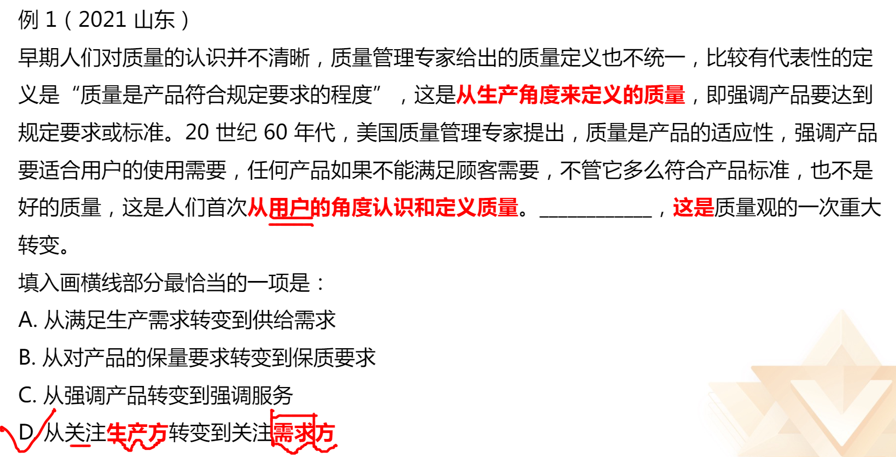
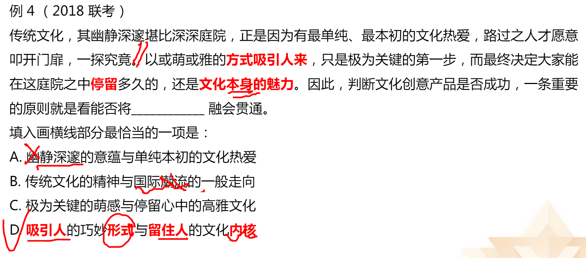
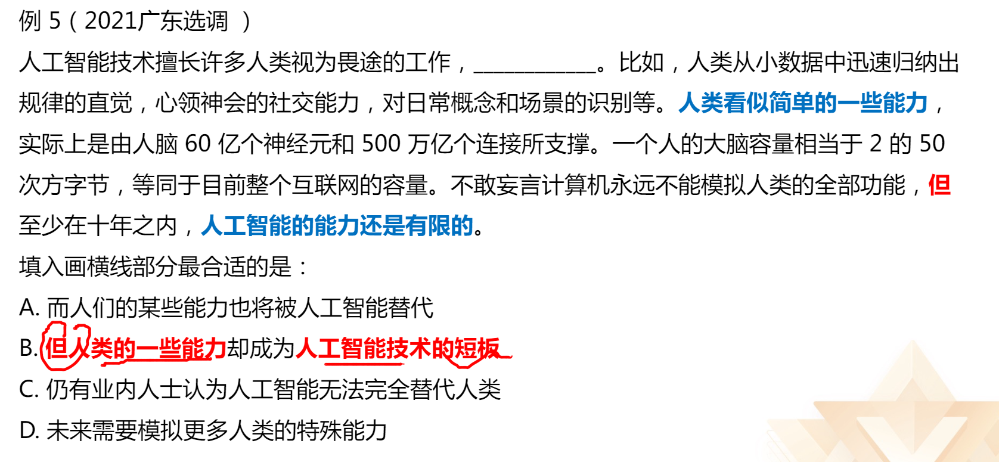
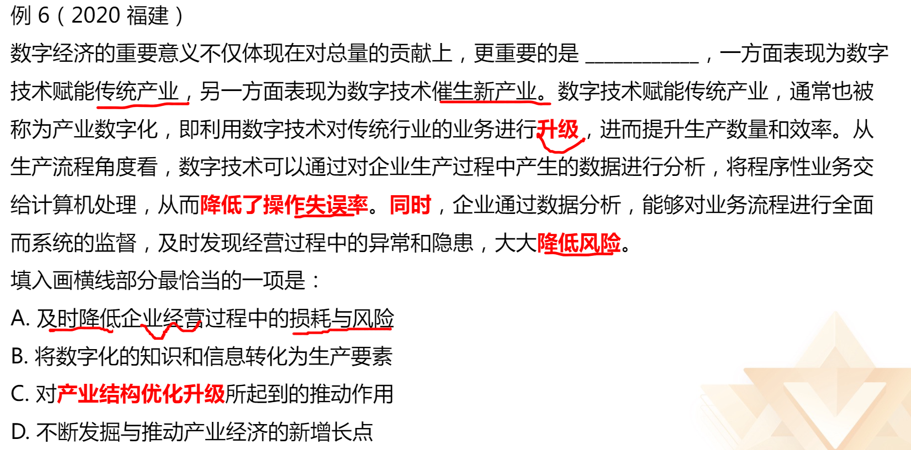
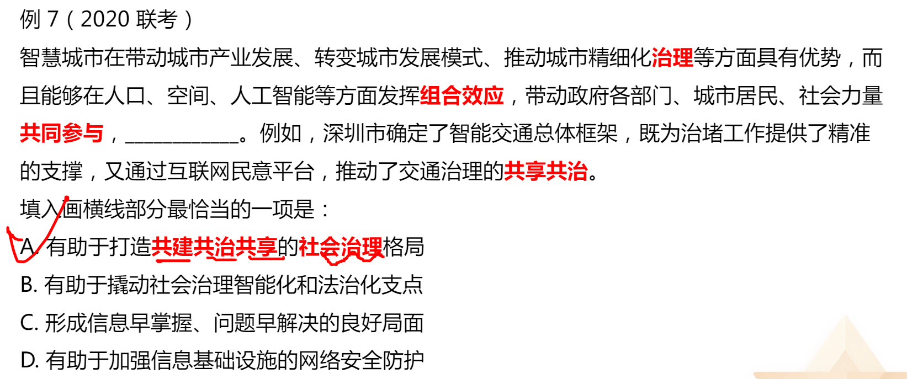
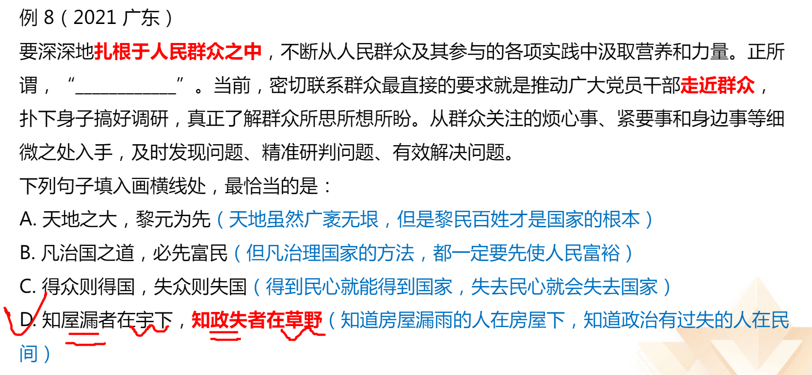
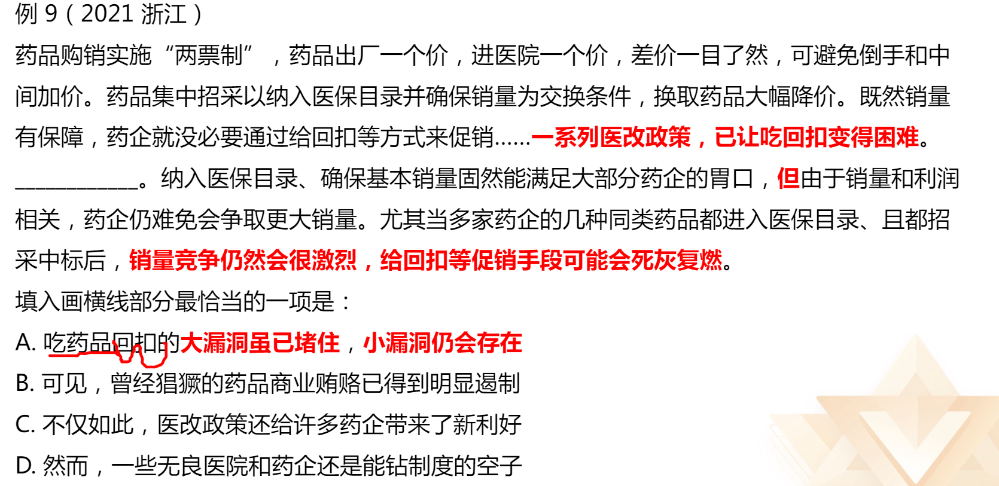
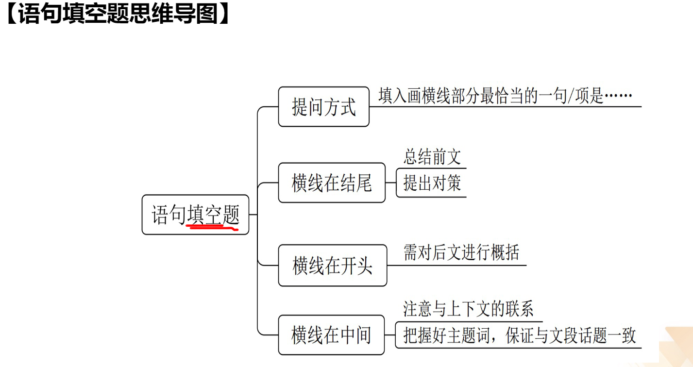

#### 题型：
1. 语句填空
2. 语句排序
3. 接语选择

# 理论要点

## 横线在结尾：

**主题词要与前文一致 **
1. 总结前文
2. 提出对策

## 横线在开头：

概括文段的中心内容（总分）

## 横线在中间：

1. 注意与上下文的联系
2. 把握好主题词，保证文段话题一致

坚守人民情怀，首要之处是尊重人民主体地位。“天地之大，黎元为先。”人民是我们党执政
的最大底气，是决定党和国家前途命运的根本力量。在近百年的奋斗历程中，我们党始终把人
民立场作为根本立场，把为人民谋幸福作为根本使命，把全心全意为人民服务作为根本宗旨，
把尊重人民主体地位和首创精神作为方法原则。

坚守人民情怀，关键环节是密切联系群众。“得众侧得国，失众侧失国。”中国共产党成长发
展的历史表明，我们党来自人民，为人民而生，因人民而兴。始终与人民心心相印、与人民同
甘共苦、与人民团结奋斗，是我们党的光荣传统。可以说，我们党的历史就是密切联系群众而
夺取革命、建设和改革事业伟大胜利的历史。

一中国青年报《牢牢坚守人民情怀》

## 语言填空总结

