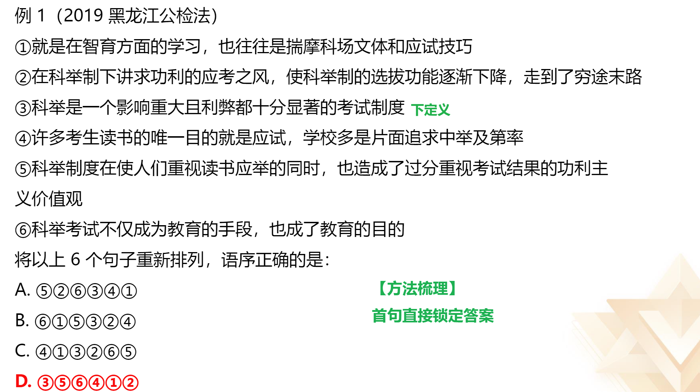
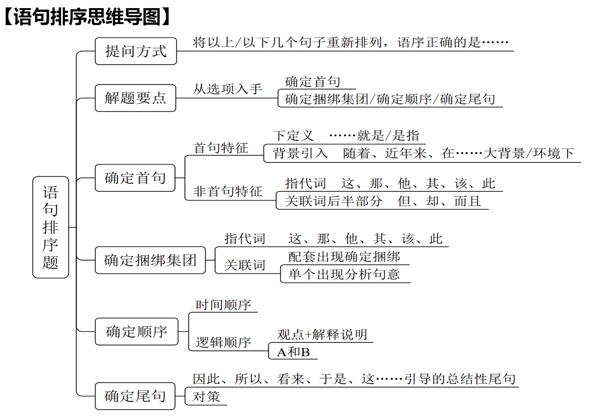

#### 题型：
1. 语句填空
2. 语句排序
3. 接语选择

# 语句填空

## 横线在结尾：

**主题词要与前文一致 **
1. 总结前文
2. 提出对策

## 横线在开头：

概括文段的中心内容（总分）

## 横线在中间：

1. 注意与上下文的联系
2. 把握好主题词，保证文段话题一致

坚守人民情怀，首要之处是尊重人民主体地位。“天地之大，黎元为先。”人民是我们党执政
的最大底气，是决定党和国家前途命运的根本力量。在近百年的奋斗历程中，我们党始终把人
民立场作为根本立场，把为人民谋幸福作为根本使命，把全心全意为人民服务作为根本宗旨，
把尊重人民主体地位和首创精神作为方法原则。

坚守人民情怀，关键环节是密切联系群众。“得众侧得国，失众侧失国。”中国共产党成长发
展的历史表明，我们党来自人民，为人民而生，因人民而兴。始终与人民心心相印、与人民同
甘共苦、与人民团结奋斗，是我们党的光荣传统。可以说，我们党的历史就是密切联系群众而
夺取革命、建设和改革事业伟大胜利的历史。

一中国青年报《牢牢坚守人民情怀》

## 语言填空总结

# 语句排序

**提问方式：**

'将以下几个句子重新排列组合最连贯的是？

**理论要点：**
1. 根据选项提示对比后确定首句
2. 确定捆绑集团/确定顺序/确定尾句
3. 验证(只验证你基本锁定的答案，而非全部验证、只看逻辑不看通顺)

## 解题方法

### 1、确定首句：

1. 首句特征：
	1. 下定义（......就是/是指）
	2. 背景引入（随着、近年来、在......大背景/环境下）
2. 非首句特征：
	1. 关联词后半部分单独出现（因此、但是）
	2. 指代词指代不明确一般不适合做首句
		人称代词：他/她/它/他们
		指示代词：这/那/此

### 2、确定捆绑集团

#### 指代词捆绑

这、那、他、该、其/这些、它们

**举个小例：**
1. 甲午中日战争前后共举办15年，有七期毕业生
2. 最早兴办的新式军教育机构是1885年李鸿章于天津设立的武备学堂
3. 该学堂的设立本是中法战争的结果之一，目的是培养下级军士和军官
	A.13  B.23

#### 关联词捆绑

1. 配套出现 (不但…而目.…/虽然…但是.…)

2. 单独一个
	1. 转折：前后语意相反
	2. 并列：句式一致

### 3、确定顺序

#### 时间顺序

- 具体年份（2017年、2018年）
- 朝代（宋元明清）
- 表示时间的词语（过去、现在、将来）

**注意：** 后来是过去

朝代歌
三皇五帝始，尧舜禹相传
夏商与西周，东周分两段
春秋与战国，一统秦两汉
三分魏蜀吴，两晋前后延
南北朝并立，隋唐五代传
宋元明清后，王朝至此完
民国再共和，代代往下传

#### 逻辑顺序

1. 观点+解释说明
	我们班的同学腿都长
	比如张二狗就有1.8米大长腿
2. A和B

### 4、确定尾句

**结论、对策**
- 因此、所以、看来、于是、这、应该、需要

完美尾句：结论+对策

## 语句排序总结

# 接语选择

**提问方式：** 作者接下来最有可能讲述的是......

**理论要点：** 重点关注文段最后一句话

**干扰项特征：** 文段中已经论述过的内容

### 接语选择总结

