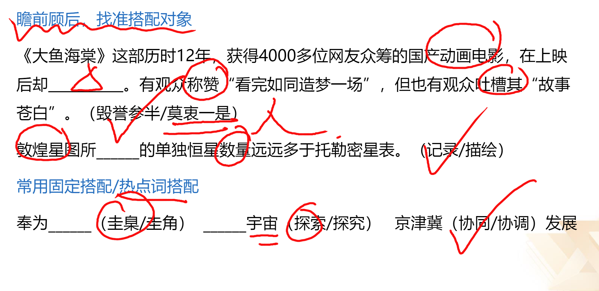
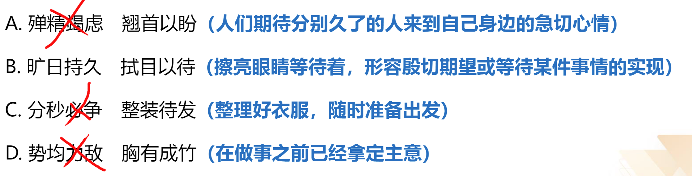
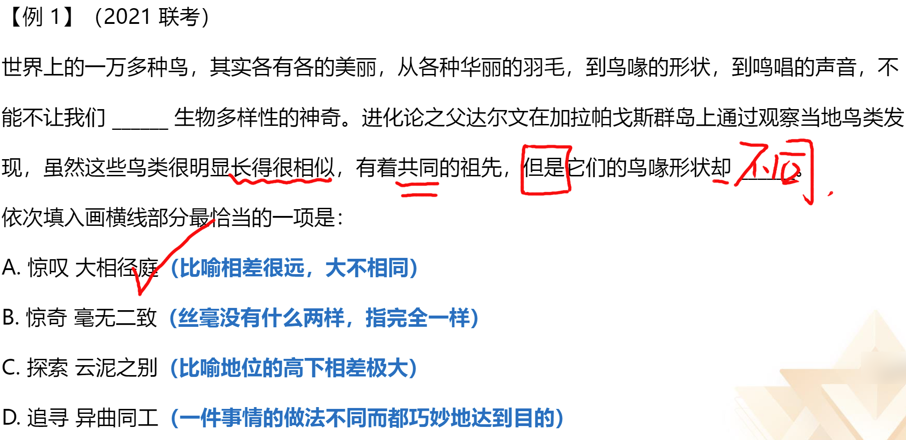
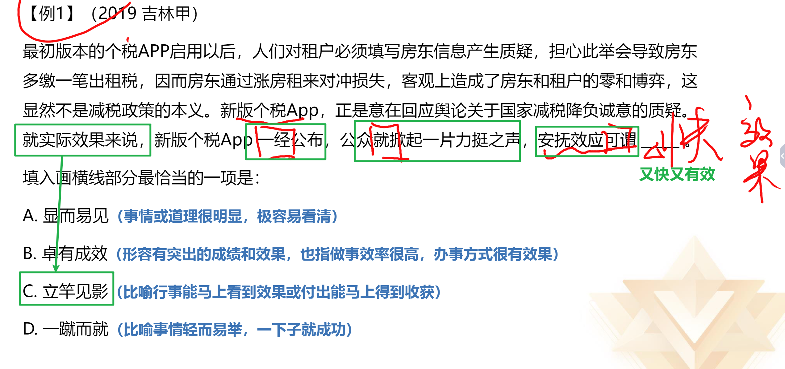

词语积累建议：
1. 刷题中积累，题目中出现的词语积累意思和用法
2. 礼包图书：《言语必会成语100组》、《言语必学实词200组》、
	《言语"搭配”速记》
3. 微信小程序-粉笔快练：高频成语、必备实词
	阅读材料：官媒评论文章（人民网、光明网、中国社会科学网、南风窗、澎湃新闻等)、学习强国（新思想）

# 一、词的辨析

**考点：**
1. 词义侧重
2. 固定搭配
3. 程度轻重
4. 感情色彩

**【辨析方法】**
## 1、用不一样的字组词

## 2、整词进行固定搭配

【拓展】字字珠玑：比喻说话、文章的词句十分优美。有时也延伸指说话或写文章言简意深，凝炼有力
春风化雨：比喻良好的熏陶和教育

**注意：**
横线所填词语搭配由“和、及、与”引导的并列结构
所填词语需与并列结构搭配恰当

## 3、程度轻重

缺陷-缺点-瑕疵（成都越来越轻）

截然相反（重）  大相径庭（轻） 

**理论要点：** 所填词语的程度与文段意思的轻重保持一致

**注意**：文段中出现更、甚至、乃至、遑论等词语时，语义程度前轻后重。
**举个小例：**
这篇文章的观点是存在（D）甚至错误的。
A.正确  B分歧  C.大错特错  D.偏差

鱼目混珠：指用鱼眼冒充珍珠，强调假与真的关系，主语往往是假货、次品。
鱼龙混杂：指鱼和龙在一起，坏的和好的在一起，主语往往是个更大的、好坏均有的集合。

鱼龙混杂、龙蛇混杂、良莠不齐、泥沙俱下，不必区分，搭配对象广(人/物)

**捉襟见肘**：形容衣服破烂，生活穷困。后也比喻顾此失彼，穷于应付。
1、解决当今人类遭遇的各种难题和危机，单靠一种文明价值的智慧和能量，常常显得捉襟见肘。
2、目前中国仅有四艘综合补给舰在海军服役，维持日益繁重的远洋训练、护航和演习，显得有些捉襟见肘。
3、我们唯一的地球面积有限，除了那些不适合人居住的地域，亚洲、非洲、拉丁美洲的许多国家剩下的国土已然捉襟见肘。

 
## 4、感情色彩

成果-结果-后果（好 中 坏） 

趋之若鹜（贬义）    不胜枚举（中）
争先恐后（中）        罄竹难书（贬义）

**理论要点：**
1. 褒义、贬义、中性
2. 所填词语的感情色彩与文段的感情色彩保持一致

## 词的辨析总结

# 二、语境分析

**关联关系**：转折、因果、并列
**对应关系**：解释类、重点词句

## 关联关系
### 1、关联关系一转折
**【标志词】**：但是、可是、然而、却、其实、实际上等
**【理论要点】**：前后语义相反

**举个小例：**
第1和第2经常是对手，但倒数第1和倒数第2基本都是（）。
A.朋友    B.敌人

**【成语拓展】**
熙熙攘攘：形容人来人往，非常热闹
不刊之论：比喻不能改动或不可磨灭的言论，
用来形容文章或言辞的精准得当，无解可击
文不加点：形容文思敏捷，写作技巧纯熟
目无全牛：形容人的技艺高超，得心应手，已经到达非常纯熟的地步
登堂入室：比喻学问由浅入深、循序渐进、达到更高的水平
危言危行：说正直的话，做正直的事。
路人皆知：比喻人所共知的野心。

### 2、关联关系—因果关系
**标志词**：因为.所以、由于.因此、从而、导致、使得、造成等
**理论要点**：横线前后构成因果关系

**举个小例**：
由于小欧认真听课，大量刷题，所以他( )了。
A.上岸    B.失恋

### 3、关联关系-并列

**【标志词】：**
1. 同义并列： 顿号（、)、逗号（，)
作风建设要以踏石留印、（ ）的劲头抓下去。    A抓铁有痕    B如履薄冰
2. 反义并列： 不是...而是...、是...不是...、相反、反之等
积极的人像太阳，照到哪里哪里亮。相反，(  )的人像月亮，初一十五不一样。
A.低调    B消极

**【标志句式】**：句式相同或相近
**【理论要点】**：同义并列语义相近，反义并列语义相反

## 对应关系

1. 解释类对应
2. 重点词对应

### 1、对应关系—解释类对应

**有标志：**
标志词：是、即、无异于、无疑是、比如、例如、因此、可以说等
标点符号：冒号(：)、破折号(——）

定义的使命是抽象、概括出某类事物的本质特征。当定义概括不了时，本应修正定义，而有人
却常常“开除”那些概括不了的同类事物，以维护定义的纯洁性，这无疑是（B）
(A指鹿为马    B.削足适履)

**无标志：**
通过前后分句对横线内容进行解释说明

信用卡的实质就是（A）我们，让我们感觉不到付账的痛苦。(A.麻醉    B.蒙蔽)

 

### 2、对应关系—重点词句对应

- 形象表达
- 指代词
- 主题词
- 前后呼应

#### 形象表达

标志： 有如、就像、类似、“ ” 等

答题要点： 所填词语与形象表达的词语形成对应
1. 人生如戏，全靠（）。
A. 努力    B. 演技
2. 原来蕈蚊头上的触角就像人类的鼻子，能感受并（）不同的气味。
A.区分    B.追踪
3. 沾上了文学的历史与新闻就像到了岔路口，不光是（）,可能还会走向对立。
A.分道扬镳    B.前途未人

【粉笔提示】不折不扣：不打折扣，表示完全，十足，彻底（中性词）
(2020国考)地球并非太阳系唯一有水的星球，木卫二所拥有的水资源就比地球还多，堪称一颗不折不扣的”水球”。
(2021模考)改革需要务实，既需要务实的精神，更需要务实的举措。要发挥钉钉子精神，从改革
的层级开始，一竿子插到底，确保改革的全过程不折不扣、上下一致。
(2011吉林)有公心，就应该不折不扣地依规章、依程序办事，不以个人好恶改变规则，增减程序(人民网)旗帜鲜明讲政治、保证党的团结和集中统一，必须把党中央决策部署不折不扣地贯彻落实到各方面工作中，在推动事业发展上见真章出实效。

#### 指代词
标志： 这、此、那、彼
答题要点：所填词语与代词指代的内容形成对应
砍头不要紧，只要主义真”，这是（）的力量。
A.信仰    B.知识
古人行文简略，优秀的作品常常“字不虚设”，阅读者决定不予深究的地方，有可能正是作者用心良苦之所在。因此我们阅读时不宜有所偏，应该像作家写作这些文章时那样“ “。(字斟句酌/心无旁骛) 

【粉笔提示】浮光掠影VS走马观花VS浅尝辄止VS蜻蜓点水
浮光掠影：比喻对事物观察不细致，印象不深。侧重强调印象不深的结果。
(2016联考)浅阅读虽能够收获一些印象式的谈资，但浮光掠影之中透露出的是浮躁心气，很难沉淀为提升阅读者主体素质的扎实“文化准备”。
走马观花：比喻粗略地观察事物，常用于观光旅游或工作视察等。
(2010山东)敦煌壁画共有五万多平方米，若按高为一米来排列，有50多公里长，即使走马观
花，也要夜以继日。
浅尝辄止：略微尝试一下就停下来，指不深入钻研，多用于学习、研究领域。
(2013联考)但限于当时的能力，主要做的是海洋的表面文章，对于海面之下隐藏的深海神秘世界，则只是浅尝辄止。
蜻蜓点水：比如做事情肤浅不深入。
(2020江苏)执法检查是人大行使宪法法律赋予的监督权，也是保证法律得到全面有效实施的一把“利剑”。既然是“利剑”，就必须锋利，而不是蜻蜓点水、无关痛痒。

#### 主题词

标志： 主题词（核心话题）
答题要点： 所填词语与主题词形成对应
1、在嘈杂环境下，大脑会自动过滤不熟悉的人的声音，只接收身边熟人所发出的声音。在这种情况下，那些不熟悉的话语声只好面对（）的命运。
A.充耳不闻    B.灰飞烟灭
2、从统计学角度看，用平均数指标反映趋势虽精确敏感，但也有其致命弱点，尤其是平均数的”（）”，很容易掩盖个体之间的差异。
A以管窥天    B.削峰填谷

#### 前后呼应

答题要点： 所填词语与前后文内容形成对应

在那个（）的地球上，海洋占据了世界的绝大部分，而无垠的大海之下是数亿年连绵不断的火山活动。在某些机缘巧合之下，海水中产生了史上第一批有机大分子，从而点燃了生命的星星之火。
A.病入膏肓    B.了无生机

 

【粉笔拓展】因噎废食：因为怕出问题，索性不干
1. 生态的危机因人而起，也只有通过人自己的合理活动来克服。单纯地由于人的作用导致生态困境而拒斥人的活动，无异于因噎废食。
2. 一场惨痛的飞机失事，使海外游学夏令营成为舆情关注的焦点，也使游学乱象集中地暴露出来。可是，如果因此叫停各种暑期夏令营活动，那就是因噎废食的”懒政”思维了。
3. 经济全球化出现一些问题并不可怕，但因为出现一些问题就动辄“退群”“脱钩”筑墙”，无疑是因噎废食。

## 语境分析总结

