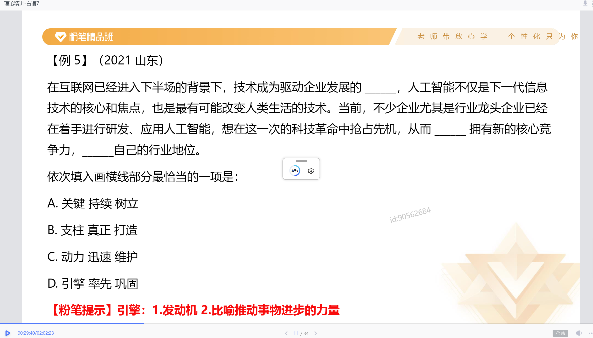

词语积累建议：
1. 刷题中积累，题目中出现的词语积累意思和用法
2. 礼包图书：《言语必会成语100组》、《言语必学实词200组》、
	《言语"搭配”速记》
3. 微信小程序-粉笔快练：高频成语、必备实词
	阅读材料：官媒评论文章（人民网、光明网、中国社会科学网、南风窗、澎湃新闻等)、学习强国（新思想）

# 一、词的辨析

**考点：**
1. 词义侧重
2. 固定搭配
3. 程度轻重
4. 感情色彩

**【辨析方法】**
## 1、用不一样的字组词

## 2、整词进行固定搭配

【拓展】字字珠玑：比喻说话、文章的词句十分优美。有时也延伸指说话或写文章言简意深，凝炼有力
春风化雨：比喻良好的熏陶和教育

**注意：**
横线所填词语搭配由“和、及、与”引导的并列结构
所填词语需与并列结构搭配恰当

## 3、程度轻重

缺陷-缺点-瑕疵（成都越来越轻）

截然相反（重）  大相径庭（轻） 

**理论要点：** 所填词语的程度与文段意思的轻重保持一致

**注意**：文段中出现更、甚至、乃至、遑论等词语时，语义程度前轻后重。
**举个小例：**
这篇文章的观点是存在（D）甚至错误的。
A.正确  B分歧  C.大错特错  D.偏差

鱼目混珠：指用鱼眼冒充珍珠，强调假与真的关系，主语往往是假货、次品。
鱼龙混杂：指鱼和龙在一起，坏的和好的在一起，主语往往是个更大的、好坏均有的集合。

鱼龙混杂、龙蛇混杂、良莠不齐、泥沙俱下，不必区分，搭配对象广(人/物)

**捉襟见肘**：形容衣服破烂，生活穷困。后也比喻顾此失彼，穷于应付。
1、解决当今人类遭遇的各种难题和危机，单靠一种文明价值的智慧和能量，常常显得捉襟见肘。
2、目前中国仅有四艘综合补给舰在海军服役，维持日益繁重的远洋训练、护航和演习，显得有些捉襟见肘。
3、我们唯一的地球面积有限，除了那些不适合人居住的地域，亚洲、非洲、拉丁美洲的许多国家剩下的国土已然捉襟见肘。

 
## 4、感情色彩

成果-结果-后果（好 中 坏） 

趋之若鹜（贬义）    不胜枚举（中）
争先恐后（中）        罄竹难书（贬义）

**理论要点：**
1. 褒义、贬义、中性
2. 所填词语的感情色彩与文段的感情色彩保持一致

## 词的辨析总结

# 二、语境分析

**关联关系**：转折、因果、并列
**对应关系**：解释类、重点词句

### 1、关联关系一转折
**【标志词】**：但是、可是、然而、却、其实、实际上等
**【理论要点】**：前后语义相反

**举个小例：**
第1和第2经常是对手，但倒数第1和倒数第2基本都是（）。
A.朋友    B.敌人

**【成语拓展】**
熙熙攘攘：形容人来人往，非常热闹
不刊之论：比喻不能改动或不可磨灭的言论，
用来形容文章或言辞的精准得当，无解可击
文不加点：形容文思敏捷，写作技巧纯熟
目无全牛：形容人的技艺高超，得心应手，已经到达非常纯熟的地步
登堂入室：比喻学问由浅入深、循序渐进、达到更高的水平
危言危行：说正直的话，做正直的事。
路人皆知：比喻人所共知的野心。

## 2、关联关系—因果关系
**标志词**：因为.所以、由于.因此、从而、导致、使得、造成等
**理论要点**：横线前后构成因果关系

**举个小例**：
由于小欧认真听课，大量刷题，所以他( )了。
A.上岸    B.失恋

